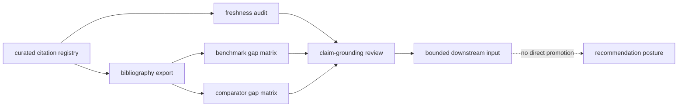

# Workflow Literature Audits

`bijux-proteomics-knowledge` compares curated scientific reading with each
shipped benchmark sentence. The audit preserves where the literature:

- still supports the shipped workflow-family sentence
- is aging and needs recheck discipline
- already outruns the benchmark or comparator packet we currently ship
- should slow recommendation posture instead of silently being assumed

## Audit Questions

The literature audit stack answers four direct questions independently of
whether a Runtime lane executes:

- which citations currently ground this workflow family
- when those citations were last rechecked in the curated registry
- where the literature still outruns the shipped benchmark or comparator proof
- which machine-readable bibliography export an outsider should open first

## Public Surfaces

- `get_workflow_literature_freshness_audit(...)`
- `get_workflow_bibliography_export(...)`
- `get_benchmark_literature_gap_matrix()`
- `get_comparator_literature_gap_matrix()`

These are knowledge surfaces, not runtime or intelligence surfaces. They do not
decide execution readiness, recommendation posture, or lab consequence. They
keep the scientific reading state inspectable so those downstream packages
cannot widen language on stale or selectively remembered grounding.

## Opening Order

Open the stack in this order when you are reviewing one workflow family:

1. open the matching workflow claim-grounding page to see the current repository
   sentence
2. open the freshness audit to see whether the curated citation set is still
   recently checked
3. open the machine-readable bibliography export to inspect what specific
   reading is actually carried
4. open the benchmark and comparator gap matrices to see whether current
   benchmark pressure still lags the literature

This order matters. A bibliography export without the gap matrices can make the
reading look broader than the shipped benchmark packet really is.

## What The Freshness Audit Means

Freshness here is the curated repository audit state.

It records:

- the latest recheck date preserved in the citation and literature registries
- whether a stable DOI or URL still exists in that curated audit
- whether the current workflow-family summary is already aging past the shipped
  literature surface

It does not pretend that runtime code is doing live citation crawling or
automated truth discovery from the public web.

## Machine-Readable Bibliography Exports

Each workflow family exposes one machine-readable bibliography export:

| workflow family | bibliography export |
| --- | --- |
| `dda` | `workflow_bibliography:dda` |
| `dia` | `workflow_bibliography:dia` |
| `lfq` | `workflow_bibliography:lfq` |
| `multiplex` | `workflow_bibliography:multiplex` |
| `ptm` | `workflow_bibliography:ptm` |
| `targeted` | `workflow_bibliography:targeted` |

Each export carries title, DOI or stable URL, publication year, relevance tags,
contradiction tags, and freshness state.

This is the durable handoff surface for outside review. The point is that a
reader should be able to inspect what the repository is actually citing without
rebuilding the reading list from prose footnotes.

## What The Gap Matrices Add

The two gap matrices answer different questions:

- `get_benchmark_literature_gap_matrix()` asks where the shipped benchmark
  package still under-covers the stronger reading
- `get_comparator_literature_gap_matrix()` asks where comparator pressure still
  under-covers the stronger reading

That separation matters because one family can look well cited and still remain
weak in benchmark breadth, comparator stress, or both.

## Audit Dispositions

| Audit result | Required disposition |
| --- | --- |
| citations are current and aligned with the benchmark sentence | retain the bounded grounding and its recheck date |
| literature outruns benchmark or comparator pressure | record the gap and narrow downstream language until the shipped evidence catches up |
| curated registry is stale | mark review due; do not present freshness as current scientific confirmation |
| a material source contradicts the shipped sentence | route the contradiction explicitly rather than averaging it into supporting evidence |
| source text cannot be redistributed | preserve citation identity and licensed metadata without copying prohibited content |

## Evidence Limits

- that every cited study is equally strong or equally relevant
- that literature support by itself upgrades workflow-family public wording
- that freshness replaces contradiction handling, benchmark pressure, or lab
  consequence

## Best Next Routes

- Open [Workflow Claim Grounding](https://bijux.io/bijux-proteomics/06-bijux-proteomics-knowledge/foundation/workflow-claim-grounding/)
  when the question is which exact sentence the repository currently thinks is
  justified.
- Open [Workflow Families](https://bijux.io/bijux-proteomics/01-bijux-proteomics/foundation/workflow-families/)
  when the question broadens from one reading surface to the whole family
  packet.
- Open [Workflow Recommendation Challenges](https://bijux.io/bijux-proteomics/05-bijux-proteomics-intelligence/foundation/workflow-recommendation-challenges/)
  when the dispute is no longer about the reading itself but about what the
  decision layer did with it.

## Authority Boundary

The literature audit owns citation freshness, bibliography identity, and the
relationship between current reading and evidence gaps. Claim Grounding owns
the supported sentence, Core owns benchmark evidence, Runtime owns execution,
and Intelligence owns recommendation posture. No literature-audit result can
promote those independent authorities by itself.
