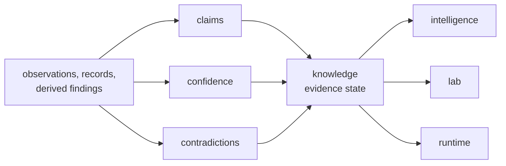

# bijux-proteomics-knowledge

`bijux-proteomics-knowledge` owns evidence state in `bijux-proteomics`. It is
where claims, confidence, contradiction handling, and knowledge-level review
rules stay explicit instead of being spread across runtime or scoring code.
This package matters because serious systems do not only need facts; they need
structured disagreement, confidence, and traceable reasons to hesitate.

## What This Package Protects

- recommendation code cannot quietly rewrite evidence state
- runtime code cannot smuggle operational convenience in as scientific truth
- contradiction is preserved as information instead of being treated as failure

## What It Owns

- evidence records and claim state
- confidence semantics and contradiction handling
- knowledge-level review boundaries used by downstream packages

## Start With

- Open [Foundation](https://bijux.io/bijux-proteomics/06-bijux-proteomics-knowledge/foundation/)
  for the package role and boundary.
- Open [Interfaces](https://bijux.io/bijux-proteomics/06-bijux-proteomics-knowledge/interfaces/)
  when the question is a claim, evidence, or confidence-facing contract.
- Open [bijux-proteomics-intelligence](https://bijux.io/bijux-proteomics/05-bijux-proteomics-intelligence/)
  when the change becomes ranking policy rather than evidence truth.

## What It Refuses

- scoring and recommendation policy
- execution orchestration and operator surfaces
- assay planning and outcome promotion

## First Proof Check

- `packages/bijux-proteomics-knowledge/src/bijux_proteomics_knowledge`
- `packages/bijux-proteomics-knowledge/tests`
- confidence and contradiction modules once the claim narrows to one seam
