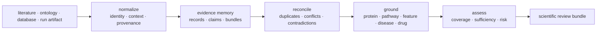
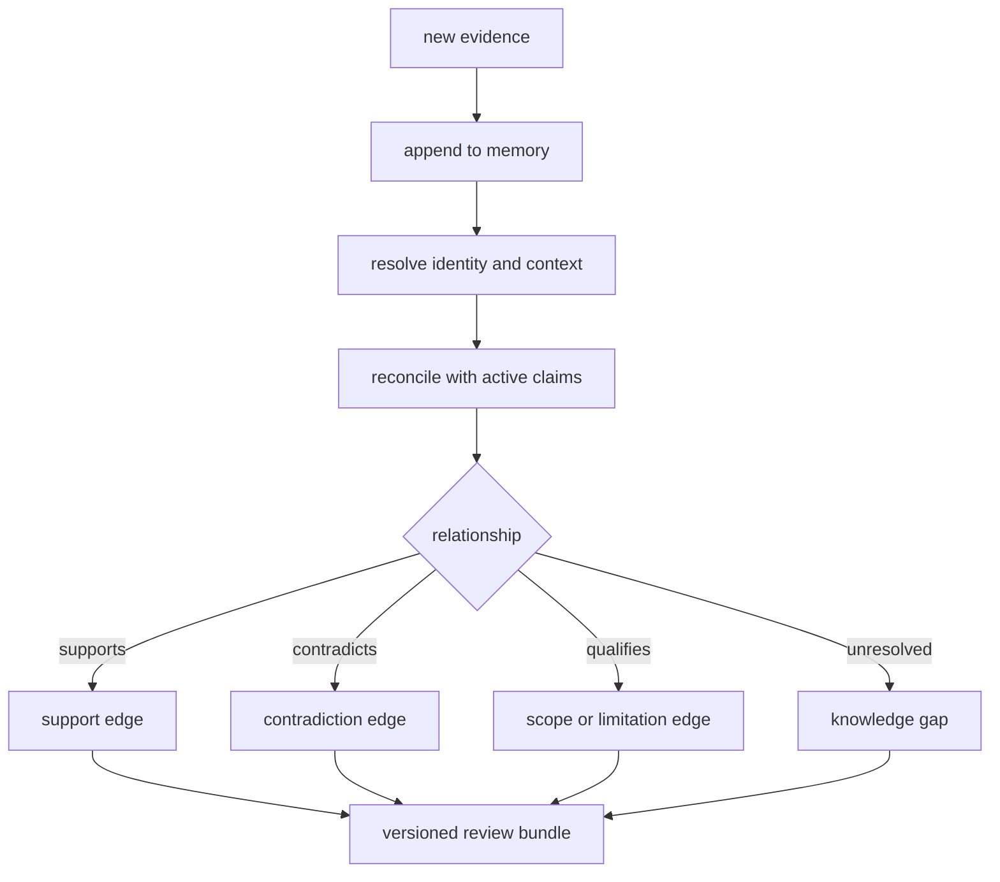
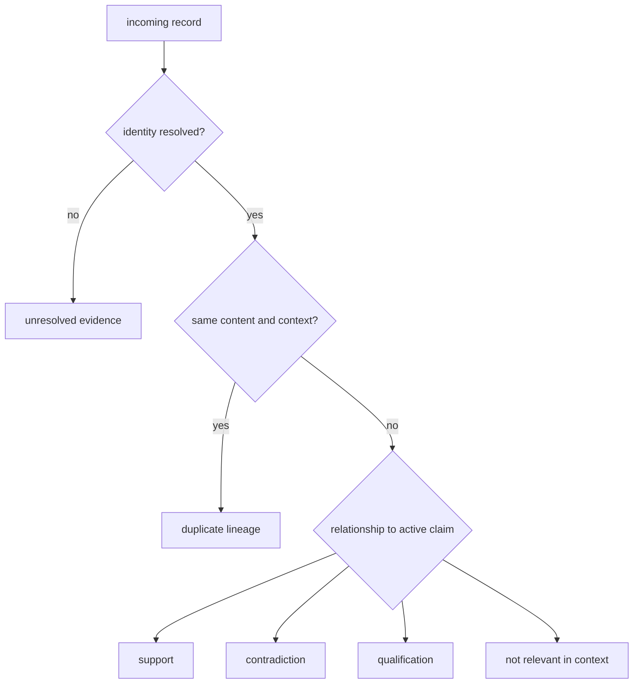

# bijux-proteomics-knowledge

`bijux-proteomics-knowledge` is the scientific memory and grounding layer. It
records claims, evidence, provenance, context, and contradictions, and it
resolves proteomics results against biological entities without turning those
records into a recommendation policy.

```bash
python -m pip install bijux-proteomics-knowledge
```

## Evidence lifecycle



The package preserves disagreement. Contradictory evidence is not averaged
away, and missing context is not treated as negative evidence. Resolution
decisions retain their source and rule so they can be revisited.

## Evidence identity

A normalized evidence record keeps source identity separate from the claim it
may support. At minimum, durable evidence preserves:

| Dimension | Examples | Why it cannot be inferred later |
| --- | --- | --- |
| source identity | DOI, accession, database record, run artifact | titles and labels are not stable keys |
| source version | release, revision, retrieval time, content digest | databases and documents change |
| biological context | organism, tissue, condition, perturbation, cohort | the same observation can reverse meaning across contexts |
| analytical context | workflow, instrument, threshold, model, comparator | technical assumptions bound the claim |
| relationship | supports, contradicts, qualifies, mentions | co-occurrence is not support |
| lineage | ingestion, normalization, resolution, review parents | a summary cannot reconstruct its derivation |

## Public biological grounding

The curated root API exposes typed resolution reports and functions for:

- protein identifiers;
- protein feature overlaps;
- pathway membership and coverage confidence;
- protein-complex membership;
- kinase–substrate relationships;
- disease terms;
- drug–target relationships;
- cross-species orthologs;
- knowledge coverage and schema compatibility.

Each resolution family can render reviewable TSV output in addition to its
typed Python result. Root anchors `EvidenceRecord`, `EvidenceClaim`,
`EvidenceBundle`, and `KnowledgeDecisionBrief` connect those biological
resolutions to evidence memory and downstream review.

## Evidence and reference workflows

The deeper `references` surface provides citation and context grounding,
literature and ontology sources, curated corpora, benchmark ledgers, comparator
positions and failures, contradiction dossiers, evidence-sufficiency checks,
knowledge-deficit reports, scientific thresholds, reading packs, replay proof,
and release-facing narratives.

These workflows distinguish three questions:

1. **Was a source identified and represented correctly?**
2. **Does it support the claim in the declared context?**
3. **Is the assembled evidence sufficient for the intended use?**

A “yes” at one level does not imply a “yes” at the next.

## Claim anatomy

| Element | Required question |
| --- | --- |
| proposition | what exactly is asserted, at what granularity? |
| subject identity | which protein, peptide, feature, pathway, disease, drug, species, or experimental entity? |
| context | in which organism, tissue, condition, instrument, workflow, and time window? |
| source | where did the observation or assertion originate, and under which version? |
| support relationship | does the record support, contradict, qualify, or merely mention the proposition? |
| quality and limitations | what biases, coverage gaps, indirectness, and uncertainty constrain use? |
| intended use | is the evidence sufficient for description, prioritization, or an experimental decision? |

A source can be authoritative yet irrelevant to the declared context. A
correct identifier match can still ground the wrong biological entity or
species. Knowledge records resolution and context separately so downstream
consumers can distinguish these failures.

## Memory integrity

Evidence memory uses explicit claim and evidence models, normalized ingestion,
reconciliation, and graph-integrity checks. Provenance links the normalized
record back to its source; contradiction handling records incompatible claims
without discarding either; review briefs summarize the current state without
becoming the canonical evidence store.



New evidence appends to memory and may change the current review. It does not
erase the evidence or review state available to an earlier recommendation.

## Reconciliation outcomes

Reconciliation does not force one winner. It can identify exact duplicates,
retain context-specific variants, mark unresolved identity, connect support and
contradiction edges, or supersede a record while preserving its history.



Retrieval success, identifier resolution, and source reputation are necessary
inputs to grounding; none alone makes a claim true.

## Ownership boundary

Knowledge depends on foundation contracts and core scientific semantics. It
does not depend on runtime, intelligence, or lab. Runtime can provide a run
bundle as an input artifact; intelligence consumes the resulting scientific
review bundle; lab observations can be ingested as new evidence through an
explicit handoff. None of those consumers may mutate evidence history through
their own policy or operational state.

## Shared Reader Routes

- [Product Overview](../01-bijux-proteomics/foundation/product-overview.md)
  locates evidence custody in the complete product system.
- [Workflow Consequence Maps](../01-bijux-proteomics/foundation/workflow-consequence-maps.md)
  connect grounded claims to downstream review and action.
- [What Changed The Recommendation](../01-bijux-proteomics/foundation/what-changed-the-recommendation.md)
  shows how evidence changes remain attributable in decision history.
- [Decision Support](../01-bijux-proteomics/foundation/decision-support.md)
  explains the handoff from reconciled evidence to advisory judgment.

## Start Inside

- [Package overview](foundation/package-overview.md) maps memory, grounding,
  biological context, and review surfaces.
- [Workflow claim grounding](foundation/workflow-claim-grounding.md) traces
  public claims to support and contradiction.
- [Workflow literature audits](foundation/workflow-literature-audits.md)
  explains curated source pressure.
- [Architecture](architecture/index.md) covers memory and reconciliation
  boundaries.
- [Interfaces](interfaces/index.md) documents Python, data, and artifact
  contracts.
- [Known limitations](quality/known-limitations.md) records source, coverage,
  and inference limits.
