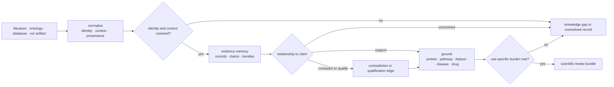
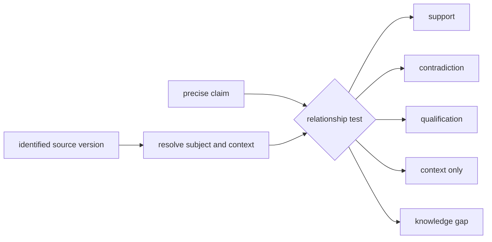
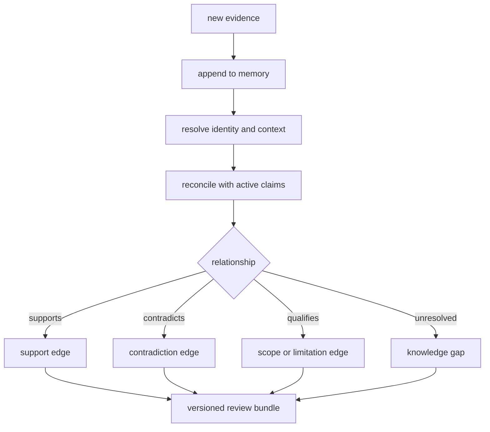
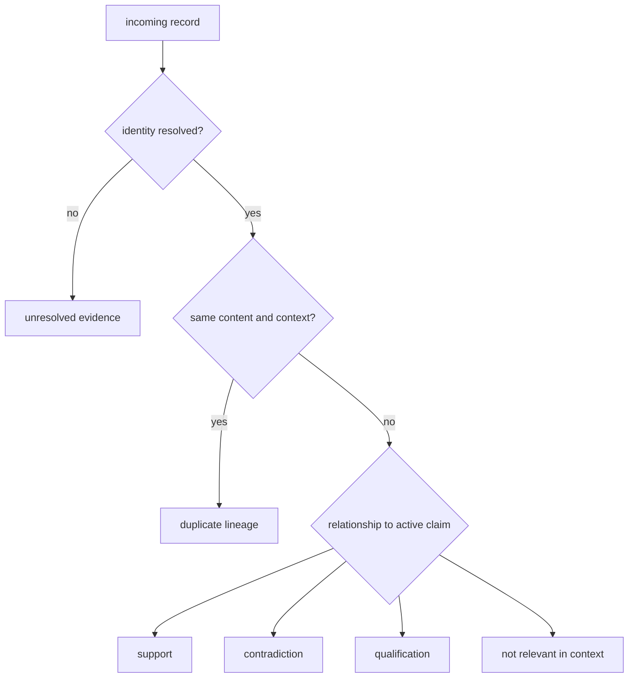
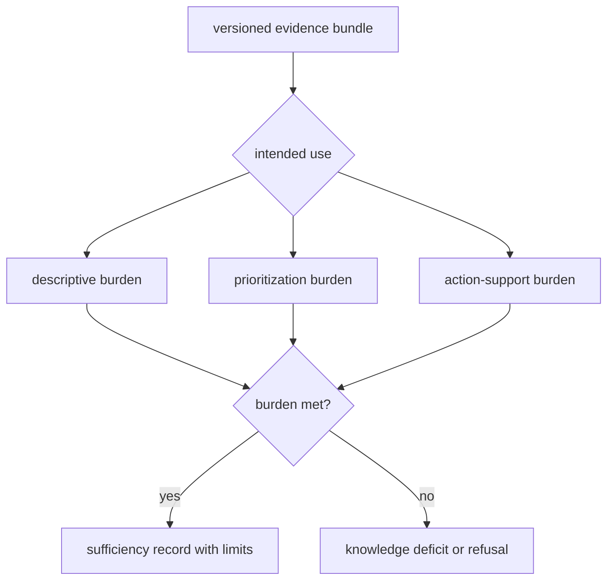
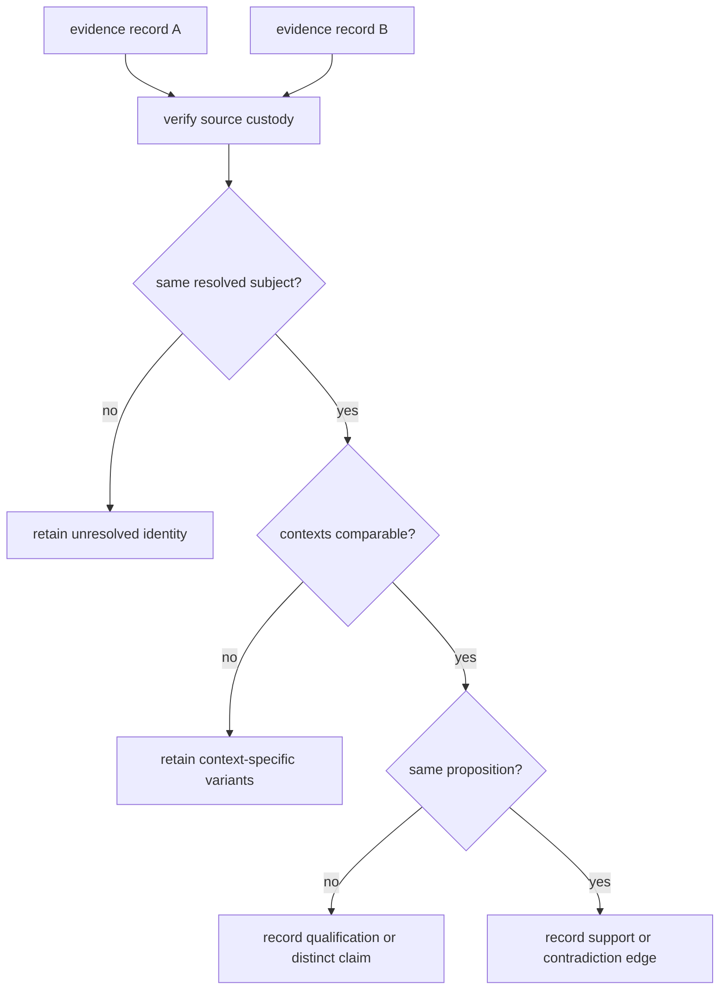

# bijux-proteomics-knowledge

`bijux-proteomics-knowledge` is the scientific memory and grounding layer. It
records claims, evidence, provenance, context, and contradictions, and it
resolves proteomics results against biological entities without turning those
records into a recommendation policy.

```bash
python -m pip install bijux-proteomics-knowledge
```

## Keep grounding separate from action

A source record, a grounded claim, an evidence-sufficiency decision, and a
recommendation are different artifacts with different owners.

| Question | Owning decision | Result |
| --- | --- | --- |
| was the source identified and represented correctly? | Knowledge ingestion and normalization | versioned evidence record or unresolved identity |
| what relationship does the source have to this precise claim and context? | Knowledge grounding and reconciliation | support, contradiction, qualification, context-only, or unresolved edge |
| does the assembled evidence meet the burden for this declared use? | Knowledge sufficiency policy | bounded review bundle, limitation, or knowledge gap |
| which candidate or action should be preferred under declared constraints? | Intelligence ranking and challenge | recommendation, condition, downgrade, escalation, hold, or refusal |
| did the authorized follow-up produce an accepted consequence? | Lab readiness, observation, and reconciliation | consequence record returned as evidence without rewriting the earlier claim |

A “yes” in one row does not imply a “yes” in the next. In particular, correct
identifier resolution cannot establish claim support, and sufficient evidence
for description may remain insufficient for prioritization or experiment.

## Evidence lifecycle



The package preserves disagreement. Contradictory evidence is not averaged
away, and missing context is not treated as negative evidence. Resolution
decisions retain their source and rule so they can be revisited.

## Evidence identity

A normalized evidence record keeps source identity separate from the claim it
may support. At minimum, durable evidence preserves:

| Dimension | Examples | Why it cannot be inferred later |
| --- | --- | --- |
| source identity | DOI, accession, database record, run artifact | titles and labels are not stable keys |
| source version | release, revision, retrieval time, content digest | databases and documents change |
| biological context | organism, tissue, condition, perturbation, cohort | the same observation can reverse meaning across contexts |
| analytical context | workflow, instrument, threshold, model, comparator | technical assumptions bound the claim |
| relationship | supports, contradicts, qualifies, mentions | co-occurrence is not support |
| lineage | ingestion, normalization, resolution, review parents | a summary cannot reconstruct its derivation |

## Public biological grounding

The curated root API exposes typed resolution reports and functions for:

- protein identifiers;
- protein feature overlaps;
- pathway membership and coverage confidence;
- protein-complex membership;
- kinase–substrate relationships;
- disease terms;
- drug–target relationships;
- cross-species orthologs;
- knowledge coverage and schema compatibility.

Each resolution family can render reviewable TSV output in addition to its
typed Python result. Root anchors `EvidenceRecord`, `EvidenceClaim`,
`EvidenceBundle`, and `KnowledgeDecisionBrief` connect those biological
resolutions to evidence memory and downstream review.

## Evidence and reference workflows

The deeper `references` surface provides citation and context grounding,
literature and ontology sources, curated corpora, benchmark ledgers, comparator
positions and failures, contradiction dossiers, evidence-sufficiency checks,
knowledge-deficit reports, scientific thresholds, reading packs, replay proof,
and release-facing narratives.

These workflows preserve the identities and decisions needed to answer the
grounding and sufficiency questions above without collapsing them into a source
count or narrative confidence label.

## Claim anatomy

| Element | Required question |
| --- | --- |
| proposition | what exactly is asserted, at what granularity? |
| subject identity | which protein, peptide, feature, pathway, disease, drug, species, or experimental entity? |
| context | in which organism, tissue, condition, instrument, workflow, and time window? |
| source | where did the observation or assertion originate, and under which version? |
| support relationship | does the record support, contradict, qualify, or merely mention the proposition? |
| quality and limitations | what biases, coverage gaps, indirectness, and uncertainty constrain use? |
| intended use | is the evidence sufficient for description, prioritization, or an experimental decision? |

A source can be authoritative yet irrelevant to the declared context. A
correct identifier match can still ground the wrong biological entity or
species. Knowledge records resolution and context separately so downstream
consumers can distinguish these failures.

## Classify each source-to-claim relationship

The relationship is evaluated against a precise proposition, not assigned to
the source as a whole. The same paper, database release, or run artifact may
support one claim and contradict, qualify, or merely contextualize another.

| Relationship | Required test | Example disposition |
| --- | --- | --- |
| supports | the observation bears directly on the proposition in a compatible context | add a support edge with scope and limitations |
| contradicts | a comparable observation is incompatible with the proposition | retain both records and add a contradiction edge |
| qualifies | the record narrows population, direction, magnitude, mechanism, or conditions | attach the limiting context; do not count it as unqualified support |
| contextual | the record explains background or plausibility without testing the proposition | retain citation value without adding claim support |
| unresolved | identity, context, or proposition alignment cannot be established | record a knowledge gap instead of guessing a relationship |



Source prestige, citation count, and identifier resolution may inform review,
but none selects the relationship without proposition-level comparison.

## Memory integrity

Evidence memory uses explicit claim and evidence models, normalized ingestion,
reconciliation, and graph-integrity checks. Provenance links the normalized
record back to its source; contradiction handling records incompatible claims
without discarding either; review briefs summarize the current state without
becoming the canonical evidence store.



New evidence appends to memory and may change the current review. It does not
erase the evidence or review state available to an earlier recommendation.

## Reconciliation outcomes

Reconciliation does not force one winner. It can identify exact duplicates,
retain context-specific variants, mark unresolved identity, connect support and
contradiction edges, or supersede a record while preserving its history.



Retrieval success, identifier resolution, and source reputation are necessary
inputs to grounding; none alone makes a claim true.

## Evidence sufficiency is use-specific

The same evidence bundle can be adequate for description and inadequate for
prioritization or experimental action. Sufficiency must therefore name the
intended use and apply its burden explicitly.

| Intended use | Minimum review burden | Stop condition |
| --- | --- | --- |
| describe an observation | resolved subject, source, context, and faithful proposition | identity or context remains unresolved |
| summarize a body of evidence | source diversity, deduplication, support and contradiction edges, coverage limits | the summary hides conflict or systematic gaps |
| prioritize a candidate | relevant support, active contradictions, comparator context, and evidence-quality assessment | ranking would depend on missing or indirect evidence |
| support an experimental decision | candidate burden plus falsifiers, uncertainty, feasibility-relevant context, and explicit review scope | consequential uncertainty has no owner or response |
| revise an earlier conclusion | new evidence identity, previous bundle identity, reconciliation result, and change explanation | history would need to be overwritten to explain the change |



Sufficiency is not stored as an unqualified property of a source or claim. It
is a versioned assessment of a named bundle against a named use.

## Ownership boundary

Knowledge depends on foundation contracts and core scientific semantics. It
does not depend on runtime, intelligence, or lab. Runtime can provide a run
bundle as an input artifact; intelligence consumes the resulting scientific
review bundle; lab observations can be ingested as new evidence through an
explicit handoff. None of those consumers may mutate evidence history through
their own policy or operational state.

## Reconcile Conflicting Evidence

Conflicting observations are not necessarily inconsistent records. They may
refer to different species, tissues, perturbations, analytical policies, time
points, or claim granularity. Reconcile identity and context before attempting
to reconcile conclusions.

| Audit step | Question | Preserve even after resolution |
| --- | --- | --- |
| source custody | can each source version and payload be reopened? | source identifiers, retrieval time, digest, and lineage |
| subject resolution | do both records refer to the same biological entity and granularity? | original identifiers and resolution rule |
| context alignment | are organism, tissue, condition, cohort, workflow, and comparator compatible? | every mismatched or missing dimension |
| proposition alignment | do direction, relation, magnitude, and time window express the same claim? | original proposition and normalized claim |
| quality review | are indirectness, bias, coverage, and analytical uncertainty comparable? | source-specific limitations |
| disposition | support, contradiction, qualification, context-specific variant, or unresolved? | both records and the rule that produced the edge |



Use [Workflow Consequence Maps](../01-bijux-proteomics/foundation/workflow-consequence-maps.md)
to see how the resolved evidence constrains action,
[What Changed The Recommendation](../01-bijux-proteomics/foundation/what-changed-the-recommendation.md)
for decision attribution, and
[Decision Support](../01-bijux-proteomics/foundation/decision-support.md) only
after the review bundle has a declared sufficiency posture.

## Continue By Evidence Question

| Need | Read next | Review is complete when |
| --- | --- | --- |
| understand memory, grounding, and review ownership | [package overview](foundation/package-overview.md) | source, normalized evidence, claim relationship, review bundle, and consumer authority remain distinct |
| trace a public claim to support and contradiction | [workflow claim grounding](foundation/workflow-claim-grounding.md) | every relationship resolves to source version, subject, context, proposition, and limitation |
| evaluate curated literature pressure | [workflow literature audits](foundation/workflow-literature-audits.md) | freshness, bibliography identity, benchmark gaps, and comparator gaps have explicit dispositions |
| inspect memory and reconciliation boundaries | [architecture](architecture/index.md) | new evidence appends relationships and review versions without overwriting history |
| choose Python, data, or artifact contracts | [interfaces](interfaces/index.md) | an independent consumer can reopen the evidence identity, provenance, relationship, and sufficiency record |
| review source, coverage, and inference limits | [known limitations](quality/known-limitations.md) | missing context, contradiction, indirectness, and coverage gaps remain visible to downstream consumers |
