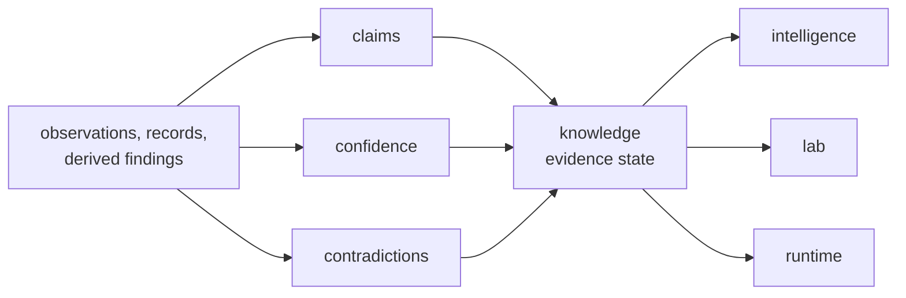

# bijux-proteomics-knowledge

`bijux-proteomics-knowledge` owns evidence state in `bijux-proteomics`. It is
where claims, confidence, contradiction handling, grounding, and knowledge-level
review rules stay explicit instead of being spread across runtime or scoring
code. Serious systems do not only need facts; they need structured
disagreement, confidence, and traceable reasons to hesitate.

This package is much richer now than a passive evidence ledger. It owns
selective scientific memory, contradiction-aware review, workflow claim
grounding, literature audit routes, and biological context surfaces that stop
the rest of the product from improvising why a workflow result should be
believed.

## What This Package Protects

- recommendation code cannot quietly rewrite evidence state
- runtime code cannot smuggle operational convenience in as scientific truth
- contradiction is preserved as information instead of being treated as failure
- stronger workflow stories can be slowed by real grounding pressure instead of
  by vague caution language

## What It Owns

- evidence records and claim state
- confidence semantics and contradiction handling
- knowledge-level review boundaries used by downstream packages
- grounding, literature-pressure, and biological-context surfaces that stop the
  repository from sounding more certain than its evidence state earns

## Concrete Knowledge Families

| owner band | visible package substance | why it matters |
| --- | --- | --- |
| `memory` and `reviews` | evidence bundles, claims, confidence, contradiction, review state | public belief can be challenged against structured memory |
| `references` | workflow grounding, literature audits, curated scientific support | release language can be read against explicit citation pressure |
| biological context owners | pathways, complexes, kinases, drugs, disease, features, coverage, orthologs | scientific meaning stays concrete instead of generic |
| `contracts` and `identity` | compatibility and entity reconciliation | downstream packages inherit one knowledge-state contract |

## Why This Package Matters More Now

- public trust language is now challenged by explicit grounding routes instead
  of general scientific tone
- stronger workflow packets need stronger contradiction and citation discipline
- downstream recommendation and lab consequence can now be traced back to
  visible evidence state instead of inferred background knowledge
- biological reasoning is now explicit enough that readers can inspect where
  confidence came from, where contradiction remains open, and why hesitation is
  scientifically responsible instead of operationally inconvenient

## Shared Reader Routes

- Use [Decision Support](https://bijux.io/bijux-proteomics/01-bijux-proteomics/foundation/decision-support/)
  when the question is still about evidence, contradiction, or public belief
  posture rather than one knowledge-owner module.
- Use [Workflow Consequence Maps](https://bijux.io/bijux-proteomics/01-bijux-proteomics/foundation/workflow-consequence-maps/)
  when the question is how contradiction pressure should narrow the current
  recommendation before assay spend is approved.
- Use [What Changed The Recommendation](https://bijux.io/bijux-proteomics/01-bijux-proteomics/foundation/what-changed-the-recommendation/)
  when the question is whether literature pressure, comparator pressure, or lab
  burden actually moved the call.
- Use [Workflow Families](https://bijux.io/bijux-proteomics/01-bijux-proteomics/foundation/workflow-families/)
  when the family route is clearer than the package route.

## Start Inside This Package

- Open [Foundation](https://bijux.io/bijux-proteomics/06-bijux-proteomics-knowledge/foundation/)
  for the package role and boundary.
- Open [Workflow Claim Grounding](https://bijux.io/bijux-proteomics/06-bijux-proteomics-knowledge/foundation/workflow-claim-grounding/)
  when the question is which exact public sentence the repository can still
  justify.
- Open [Workflow Literature Audits](https://bijux.io/bijux-proteomics/06-bijux-proteomics-knowledge/foundation/workflow-literature-audits/)
  when the question is where curated reading pressure already outruns the
  shipped benchmark or comparator packet.
- Open [Architecture](https://bijux.io/bijux-proteomics/06-bijux-proteomics-knowledge/architecture/)
  when the concern is how claims, confidence, and contradiction handling stay
  separated.
- Open [Interfaces](https://bijux.io/bijux-proteomics/06-bijux-proteomics-knowledge/interfaces/)
  when the question is a claim, evidence, or confidence-facing contract.

## Reader Questions This Package Can Answer

- which parts of a workflow story are directly grounded and which still depend
  on bounded inference
- where contradiction remains unresolved instead of being smoothed into a
  single recommendation sentence
- how literature pressure, comparator pressure, and biological-context pressure
  reshape confidence before a lab or decision surface is allowed to promote the
  claim
- whether a public workflow sentence has earned trust through explicit evidence
  state rather than tone

## What Changed Since v0.3.7

- biological context is now visible enough to count as real product substance,
  not implied support material
- contradiction and grounding routes are now concrete enough to slow an
  over-optimistic workflow story
- the package now shows where scientific hesitation comes from instead of only
  insisting that hesitation exists

## Evidence Proof Surfaces

- decision-support pages when the question is still cross-package and public
  facing
- workflow grounding and literature audit pages when the real issue is whether
  the repository can justify what it says
- architecture pages for claim, contradiction, and confidence separation
- interfaces pages for evidence and claim-facing contracts that downstream
  packages must not rewrite

## What It Refuses

- scoring and recommendation policy
- execution orchestration and operator surfaces
- assay planning and outcome promotion

## Strongest Proof Route

- start at [Decision Support](https://bijux.io/bijux-proteomics/01-bijux-proteomics/foundation/decision-support/)
  when the question is still cross-package
- continue to [Workflow Claim Grounding](https://bijux.io/bijux-proteomics/06-bijux-proteomics-knowledge/foundation/workflow-claim-grounding/)
  when the current public sentence itself is under scrutiny
- open [Workflow Literature Audits](https://bijux.io/bijux-proteomics/06-bijux-proteomics-knowledge/foundation/workflow-literature-audits/)
  when the grounding dispute becomes a reading-pressure dispute rather than an
  execution dispute

## First Proof Check

- `packages/bijux-proteomics-knowledge/src/bijux_proteomics_knowledge`
- `packages/bijux-proteomics-knowledge/tests`
- confidence and contradiction modules once the claim narrows to one seam
- grounding, citation, and contradiction-review artifacts when the public claim
  itself is under scrutiny
