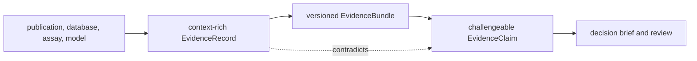

# Evidence and grounding contracts

Knowledge preserves what is known, where it came from, where it applies, and
what contradicts it. It also grounds identifiers against curated biological
references. Evidence storage and biological resolution are related but distinct
contracts.

## Evidence record

`EvidenceRecord` is an immutable-style, validated scientific statement with:

- stable evidence identity, kind, title, claim text, and related targets;
- source type, URI, origin, extraction method, and curator;
- assay, biological system, species, sample, tissue, cell-line, endpoint, dose,
  timepoint, perturbation, control, replicate, normalization, and preparation
  context;
- quantitative effect, interval, variance, p/q-value, replicate, peptide,
  coverage, localization, censoring, scale, and unit fields;
- proteomics artifact flags for missingness, interference, protein ambiguity,
  and localization uncertainty;
- confidence, strength, observation time, optional expiry, decision tags, and
  derivation lineage.

Unknown fields are rejected. Confidence and strength summarize a record under
its stated context; neither makes it transferable to a different species,
tissue, perturbation, or assay by default.

## Evidence bundle and claims

`EvidenceBundle` attaches a versioned `DocumentSchema` and a target identifier
to an ordered collection of evidence records. Governed bundles additionally
link runtime outputs, scientific summaries, and review packets by artifact ID,
schema version, SHA-256 digest, and provenance scope.

`EvidenceClaim` references supporting and contradicting evidence separately. It
also records structured subject-relation-object fields, condition, direction,
magnitude, claim type, assumptions, resolution assays, status, polarity,
resolution state, evidence state, confidence, contradiction group, and decision
impact.

Claims do not replace their evidence. A status change creates new decision
state while the cited record and its original context remain inspectable.

## Context Transfer Is A Separate Claim

Every transfer across species, tissue, cell line, perturbation, dose,
timepoint, assay, preparation, or endpoint introduces a new applicability
question. A transfer record must therefore identify the source context, target
context, governing rule, unresolved differences, and uncertainty. Copying a
confidence value into the target context is not a valid transfer.

| Source evidence | Requested statement | Required treatment |
| --- | --- | --- |
| protein-level abundance | site-specific PTM regulation | insufficient without localization evidence |
| pathway membership | pathway activity | insufficient without activity evidence and policy |
| complex membership | assembled complex in the sample | retain as membership, not assembly proof |
| kinase–substrate annotation | causal kinase activity | retain relationship type and require causal/context evidence |
| drug–target relationship | efficacy in a disease context | retain target relation and refuse efficacy promotion |
| ortholog mapping | functional equivalence | retain ambiguity and require an explicit transfer rule |

## Biological resolution

The package returns typed reports for protein identity, protein features,
pathways, complexes, kinase-substrate edges, drug-target relationships, disease
terms, orthologs, and knowledge coverage. Resolution results distinguish exact,
alias-based, ambiguous, unresolved, matched, and missing cases rather than
silently dropping failures.

Coverage-based confidence means that a configured fraction of curated members
was resolved. It does not prove pathway activity, complex assembly, kinase
causality, drug efficacy, disease mechanism, or cross-species equivalence.

## Sufficiency And Deficit Packet

A downstream decision brief should be traceable to one packet containing:

- the exact claim and intended use;
- supporting, contradicting, stale, and context-mismatched evidence identities;
- identity-resolution and relationship-resolution outcomes;
- coverage numerator, denominator, policy, and unresolved members;
- the sufficiency threshold and each failed criterion;
- a knowledge-deficit list that states what evidence could close the gap.

This packet allows intelligence to narrow or refuse a recommendation without
turning missing knowledge into a low but apparently precise confidence score.

## Contract invariants

- Evidence identity and source context survive every derived view.
- Observed, inferred, imported, and synthetic origins remain distinguishable.
- Supporting and contradicting evidence are never merged into one unsigned
  confidence number.
- Expired evidence remains historically visible but is marked stale for current
  decisions.
- Identifier ambiguity and unresolved inputs are explicit output rows.
- Curated membership coverage is reported separately from biological activity.
- Typed models are canonical; TSV and narrative outputs are review views.

These boundaries allow intelligence and lab packages to act on knowledge
without claiming more certainty than the stored evidence supports.
