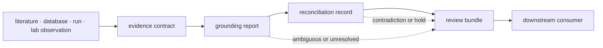

# Evidence interfaces

Knowledge interfaces carry evidence from a named source into durable memory,
through identity and context grounding, and into contradiction-aware review.
They make uncertainty a typed part of the result rather than an annotation
added after a conclusion is chosen.



## Choose an interface

| Need | Public route | Output |
| --- | --- | --- |
| store evidence or claims | evidence-memory owner modules | `EvidenceRecord`, `EvidenceClaim`, `EvidenceBundle` |
| resolve protein identity | curated root or identity module | typed resolution report and optional TSV |
| resolve biological context | feature, pathway, complex, kinase, disease, drug, or ortholog owner | source-qualified matches, ambiguity, coverage |
| inspect graph integrity | memory integrity module | missing-node, invalid-edge, and lineage findings |
| reconcile evidence | reconciliation module | classification, policy action, retained conflict |
| assemble literature or ontology review | reference grounding and workflow modules | audit, corpus, dossier, sufficiency, or deficit artifact |
| hand evidence to decision policy | review module | versioned `KnowledgeDecisionBrief` or review bundle |

The [Python API surface](api-surface.md) maps curated root exports. Use
[public imports](public-imports.md) when a specialized owner module expresses
the dependency more accurately than the package root.

## Evidence contract

A durable evidence record identifies:

- the proposition or observation represented;
- source, source version, retrieval or production context, and provenance;
- subject identity and biological context;
- observed, inferred, imported, curated, or synthetic origin;
- support, contradiction, qualification, mention, or unresolved relationship;
- quality, freshness, directness, and known limitations;
- links to superseding or derived records without destructive replacement.

[Data contracts](data-contracts.md) defines model and enumeration semantics.

## Grounding reports

Resolution functions return reports because a scalar answer would hide the
scientifically important cases. Reports distinguish resolved, ambiguous,
unresolved, incompatible, and coverage-limited outcomes and retain the source
pack used for the decision.

```python
from bijux_proteomics_knowledge import resolve_protein_ids

report = resolve_protein_ids(("P28482", "Q02750"), annotation_pack)
```

The exact annotation-pack contract and rendering routes are documented in
[entrypoints and examples](entrypoints-and-examples.md). A resolved identifier
does not establish pathway membership, disease association, or experimental
relevance; those are separate interfaces with separate evidence.

## Artifact contracts

Portable outputs include evidence bundles, graph findings, grounding reports,
coverage reports, contradiction dossiers, knowledge-deficit reports,
literature audits, reading packs, and decision briefs. Each artifact identifies
its source memory revision and assembly policy.

[Artifact contracts](artifact-contracts.md) defines persisted fields and
round-trip expectations. TSV renderers support inspection but do not replace
the typed record when nested provenance or competing resolutions matter.

## Configuration and compatibility

Source selection, alias policy, context rules, conflict policy, freshness
thresholds, and intended-use sufficiency are domain configuration. Consumers
must not substitute local defaults that reinterpret a stored review silently.
See [configuration surface](configuration-surface.md).

Status values, relationship kinds, source identity, report fields, and
serialization are compatibility surfaces. [Compatibility commitments](compatibility-commitments.md)
defines migration requirements; unknown states are not coerced into success.

## Consumer boundary

Core supplies scientific artifacts. Runtime may supply execution provenance.
Lab supplies observations. Knowledge records and reviews them. Intelligence
consumes a versioned review bundle and owns ranking. A consumer may reference
Knowledge state but cannot mutate its history through a recommendation or run
status. [Operator workflows](operator-workflows.md) shows the supported
handoffs.
