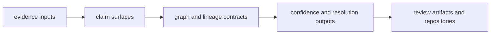

# Interfaces

`bijux-proteomics-knowledge` interfaces are the published shape of evidence
work. This section should help a reader see how evidence records, claims,
confidence segments, contradiction handling, and review payloads leave the
package in forms that other packages and human reviewers can still interrogate.

## What These Interfaces Need To Preserve

- evidence should remain traceable after it is transformed into claims or
  reviewable knowledge
- contradictions should remain visible in the interface, not hidden inside
  internal resolution code
- downstream consumers need enough structure to ask why a conclusion changed,
  not just what the new conclusion is

## Start With

- open [Data Contracts](https://bijux.io/bijux-proteomics/06-bijux-proteomics-knowledge/interfaces/data-contracts/)
  when the question is how evidence, claims, or reviews are represented
- open [Artifact Contracts](https://bijux.io/bijux-proteomics/06-bijux-proteomics-knowledge/interfaces/artifact-contracts/)
  when the concern is lineage, persisted review packets, or contradiction-aware
  outputs
- open [Operator Workflows](https://bijux.io/bijux-proteomics/06-bijux-proteomics-knowledge/interfaces/operator-workflows/)
  when the reader wants the knowledge flow rather than a code inventory
- open [Compatibility Commitments](https://bijux.io/bijux-proteomics/06-bijux-proteomics-knowledge/interfaces/compatibility-commitments/)
  before changing any surface that other packages use to reason about evidence

## Read By Evidence Question

- [Public Imports](https://bijux.io/bijux-proteomics/06-bijux-proteomics-knowledge/interfaces/public-imports/)
  for programmatic evidence and resolution entrypoints
- [Data Contracts](https://bijux.io/bijux-proteomics/06-bijux-proteomics-knowledge/interfaces/data-contracts/)
  and [Artifact Contracts](https://bijux.io/bijux-proteomics/06-bijux-proteomics-knowledge/interfaces/artifact-contracts/)
  for the durable shape of knowledge work
- [API Surface](https://bijux.io/bijux-proteomics/06-bijux-proteomics-knowledge/interfaces/api-surface/),
  [CLI Surface](https://bijux.io/bijux-proteomics/06-bijux-proteomics-knowledge/interfaces/cli-surface/),
  and [Configuration Surface](https://bijux.io/bijux-proteomics/06-bijux-proteomics-knowledge/interfaces/configuration-surface/)
  for automation and operator control
- [Entrypoints and Examples](https://bijux.io/bijux-proteomics/06-bijux-proteomics-knowledge/interfaces/entrypoints-and-examples/)
  for concrete examples of contradiction-aware use

## What This Section Should Make Clear

- which public surfaces let readers reconstruct the reasoning path from evidence
  to review output
- where confidence and contradiction are explicit interface concepts rather than
  background implementation
- why repository-facing review payloads are first-class outputs for this package

## First Proof Check

- `src/bijux_proteomics_knowledge/claims.py`, `evidence.py`, and `graph.py`
- `src/bijux_proteomics_knowledge/confidence/segments.py`, `resolution.py`, and `review.py`
- `packages/bijux-proteomics-knowledge/tests`
