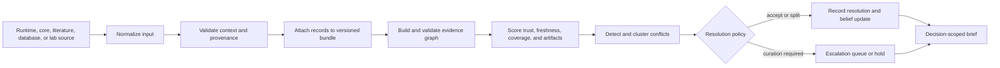

# Evidence curation workflow

Knowledge turns heterogeneous observations into inspectable evidence state. It
does not turn every imported row into a fact. The workflow retains rejected
inputs, source context, contradictions, and unresolved questions so downstream
decision support can distinguish absence of support from support for absence.

## Curate an evidence bundle

1. Convert each source into `NormalizedEvidenceInput` or a typed manual note.
   Record origin, extraction method, source URI, curator, observation time, and
   derivation.
2. Validate the target identifier and biological context. Species, system,
   sample type, perturbation, dose, timepoint, control, replicate design,
   normalization, and assay modality belong in the record when relevant.
3. Attach quantitative support without flattening uncertainty. Keep confidence
   intervals, q-values, replicate and peptide counts, localization probability,
   scale, units, censoring, and artifact flags.
4. Run ingestion with a report and retain invalid and duplicate inputs with
   reasons. Build the bundle only from accepted records.
5. Validate bundle integrity and the evidence graph. Dangling edges, missing
   lineage, duplicate IDs, and decisions without supporting paths are blockers.

## Reconcile without erasing disagreement

1. Compute trust, freshness, context compatibility, modality coverage, and
   knowledge gaps using explicit policies.
2. Detect conflicts before updating claims. Cluster them by decision tag and
   conflict type so related disagreements are reviewed together.
3. Preview the impact of a proposed resolution. High-severity, small-confidence
   gap, quantitative-direction, and context conflicts may require a hold,
   curation, or a split rather than automatic preference.
4. Persist `ClaimResolutionRecord` with the chosen action, actor, rationale,
   policy, and affected evidence. Apply belief updates without deleting the
   losing evidence.
5. Keep the escalation queue and unresolved questions in the decision handoff.

## Publish a decision-scoped view

Build `KnowledgeDecisionBrief` for one decision tag and expected context. The
brief combines ranked evidence, quality audit, evidence-state index,
hypothesis dossier, knowledge gaps, conflict clusters, trust and triangulation,
biological conclusions, operational labels, and a gate recommendation.

Publish the brief with the source bundle, claims, reference-pack identity,
policy identifiers, graph validation result, and resolution history. A future
brief may supersede the recommendation, but it should remain possible to
reconstruct why the earlier evidence state produced its original outcome.
