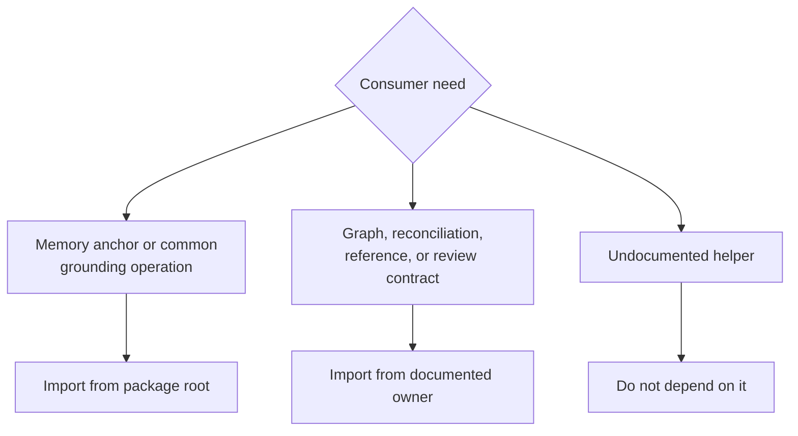

# Public imports

Knowledge uses a substantial package-root facade for its most common memory and
grounding operations. Specialized graph, reconciliation, reference, and review
contracts remain in their owner modules so the root does not erase domain
boundaries.



## Root imports

```python
from bijux_proteomics_knowledge import (
    EvidenceBundle,
    EvidenceClaim,
    compute_knowledge_coverage,
    resolve_pathway_members,
)
```

Use the root for names present in its `__all__`. These include the shared
memory anchors and complete public families for protein identity, biological
context resolution, coverage, report rendering, and schema compatibility.

## Owner-module imports

```python
from bijux_proteomics_knowledge.memory.integrity.graph import (
    EvidenceGraph,
    build_evidence_graph,
    validate_evidence_graph,
)
from bijux_proteomics_knowledge.memory.reconciliation.resolution import (
    ResolutionAction,
    ResolutionPolicy,
)
```

Use direct owner imports where the root deliberately omits the deeper contract.
This keeps graph relations, conflict policy, reference grounding, and review
assembly attached to their domain rather than turning the package root into a
catch-all namespace.

## Import ownership rules

- Import core annotation-pack and scientific result models from core, not
  through knowledge.
- Import foundation serialization and identifier primitives from foundation.
- Import knowledge memory anchors from knowledge even when intelligence also
  consumes them.
- Do not import an implementation file merely because it contains a convenient
  helper; prefer the nearest documented facade.
- Do not depend on underscore-prefixed functions or repository-only paths
  absent from the built distribution.

## More than path compatibility

For knowledge, stable imports are insufficient. The following changes can
alter downstream conclusions while every import continues to work:

- changing identity normalization or ambiguity classification;
- renaming graph relations or resolution actions;
- altering source precedence or automatic-accept thresholds;
- collapsing conflicted, contradicted, stale, or unresolved states;
- changing annotation-pack expectations or coverage denominators;
- omitting provenance, contradiction, or expiry fields from review artifacts.

Review those changes against [Data contracts](data-contracts.md),
[Artifact contracts](artifact-contracts.md), and
[Compatibility commitments](compatibility-commitments.md), not only against a
Python import test.
