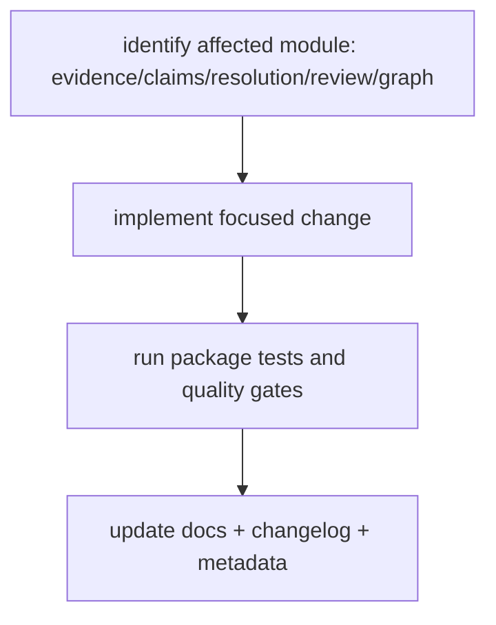

# Common Workflows

Most work on `bijux-proteomics-knowledge` follows a small set of repeatable
library-maintenance paths.

## Visual Summary

## Recurring Paths

1. Add or adjust evidence and claim behavior:
`adapters.py` -> `evidence.py` -> `claims.py` -> tests.
2. Change conflict policy logic:
`resolution.py` -> `review.py` -> tests.
3. Change serialization or schema compatibility:
`schema.py`/`serialization.py` -> tests -> docs/changelog.

## Code Areas

- `src/bijux_proteomics_knowledge/evidence.py` for evidence records and trust scoring
- `src/bijux_proteomics_knowledge/claims.py` for claim state and lineage
- `src/bijux_proteomics_knowledge/resolution.py` for conflict resolution policy
- `src/bijux_proteomics_knowledge/review.py` for decision-facing summaries
- `src/bijux_proteomics_knowledge/graph.py` for graph validation and trace paths

## Concrete Anchors

- `packages/bijux-proteomics-knowledge/pyproject.toml` for package metadata
- `packages/bijux-proteomics-knowledge/README.md` for local package framing
- `packages/bijux-proteomics-knowledge/tests` for executable operational backstops

## Use This Page When

- you are installing, running, diagnosing, or releasing the package
- you need repeatable operational anchors rather than architectural framing
- you are responding to package behavior in local work, CI, or incident pressure

## Decision Rule

Use `Common Workflows` to decide whether a maintainer can repeat the package workflow from checked-in assets instead of memory. If a step works only because someone already knows the trick, the workflow is not documented clearly enough yet.

## What This Page Answers

- how `bijux-proteomics-knowledge` is installed, run, diagnosed, and released in practice
- which checked-in files and tests anchor the operational story
- where a maintainer should look first when the package behaves differently

## Reviewer Lens

- verify that setup, workflow, and release statements still match package metadata and current commands
- check that operational guidance still points at real diagnostics and validation paths
- confirm that maintainer advice still works under current local and CI expectations

## Honesty Boundary

This page explains how `bijux-proteomics-knowledge` is expected to be operated, but it does not replace package metadata, actual runtime behavior, or validation in a real environment. A workflow is only trustworthy if a maintainer can still repeat it from the checked-in assets named here.

## Next Checks

- move to interfaces when the operational path depends on a specific surface contract
- move to quality when the question becomes whether the workflow is sufficiently proven
- move back to architecture when operational complexity suggests a structural problem

## Purpose

This page makes common package workflows easier to repeat consistently.

## Stability

Keep it aligned with the actual package structure and tests.
