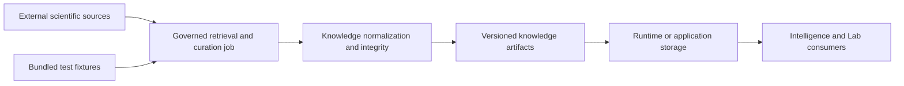

# Deployment Boundaries

Knowledge is a curation and reasoning library over explicit records. It is not a database server, search service, crawler, or live reference client. A host supplies source records and owns retrieval, persistence, scheduling, authentication, and transport.

## Deployment roles

| Role | Responsibility |
| --- | --- |
| source integration | retrieve data under source terms, capture version and retrieval context, and preserve raw provenance |
| Knowledge | validate, normalize, resolve identities, build evidence relationships, report coverage, expose conflicts, and render review artifacts |
| Runtime or application | schedule curation, persist artifacts, enforce access controls, transport outputs, and recover failed jobs |
| Intelligence | evaluate recommendation posture without rewriting curated facts |
| Lab | consume evidence context for operational planning without treating association as feasibility |

## Artifact boundary

Deploy knowledge state as versioned, fingerprinted artifacts rather than anonymous database rows. Preserve the document schema, package versions, source manifest, retrieval or release date, curation policy, input fingerprints, ingestion report, integrity findings, unresolved identities, reconciliation decisions, and coverage report.

A database may index those artifacts, but the database contents are not the sole source of truth unless they can reproduce the same governed bundle and lineage. Index rebuilds must not change evidence meaning.

## Refresh and rollout

Reference updates are scientific changes, not routine cache refreshes:

1. retrieve the new source under a new immutable manifest;
2. normalize into a separate candidate artifact;
3. compare accepted, rejected, skipped, duplicate, and unresolved records;
4. run graph integrity, identity ambiguity, contradiction, and coverage checks;
5. compare decision briefs and downstream recommendation pressure;
6. publish only after unexplained changes are resolved;
7. retain the previous artifact for rollback and historical review.

Do not mutate a published knowledge bundle in place. A consumer must be able to state which source and curation snapshot supported its conclusion.

## Security and licensing

Knowledge models provenance but does not authorize redistribution. The host must enforce source licenses, access restrictions, data classification, and retention. Credentials never belong in evidence records, citations, package configuration, or rendered reports.

## Failure ownership

Malformed evidence, unresolved identity, graph inconsistency, and explicit contradiction belong to Knowledge. Network retrieval, storage availability, job retries, and authentication belong to the host. A source that is unavailable must produce a failed or stale refresh posture—not a silently reused artifact presented as current.
