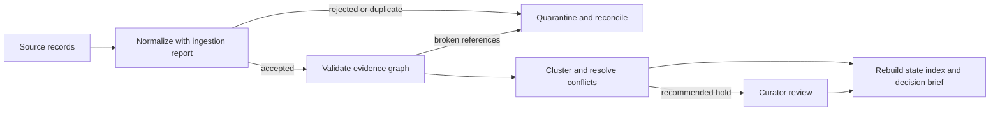

# Failure Recovery

Knowledge recovery protects meaning across evidence ingestion, identity
resolution, graph construction, conflict reconciliation, and decision briefing.
The safe objective is not to restore the largest bundle; it is to recover the
largest bundle whose records remain attributable, valid, and honestly bounded.

## Recover from the earliest failed boundary

For ingestion failures, preserve the source record and `IngestionReport`.
Reconcile input count with accepted, skipped duplicate, and rejected counts;
inspect duplicate identifiers, rejection reasons, and accepted fingerprints.
Correct the source or normalization mapping, then ingest into a copy of the last
known-good bundle. Do not silently replace an existing evidence identifier with
new content.

For graph failures, validate that claim-to-evidence links reference existing
records, relation direction is permitted, and required context is present.
Repair the source record or explicit edge. Creating placeholder evidence merely
to satisfy graph connectivity converts an integrity failure into unsupported
knowledge.

For reconciliation failures, retain all conflicting records and the trust
assessment used to group them. A conflict cluster that recommends a hold stays
on hold until a curator records a defensible resolution. Do not delete adverse
evidence, select the most convenient source, or average incompatible contexts.

## Rebuild derived views

After source records are corrected, rebuild the evidence-state index, quality
audit, conflict clusters, critical-claim provenance lines, reference
disagreement report, and decision brief. Derived trust, triangulation,
readiness, and biological-grounding states must be recomputed; editing their
serialized values would disconnect them from the bundle.

Compare record identifiers, accepted fingerprints, graph issue counts,
conflict membership, freshness, trust and triangulation scores, gaps,
recommendation, and provenance with the prior state. Schema compatibility must
also pass before a historical bundle is loaded or migrated.

Recovery is complete when counts reconcile, accepted evidence has stable
fingerprints and provenance, the graph validates, unresolved conflicts remain
visible, and the new brief can explain every recommendation change. Preserve
the failed bundle and report as historical evidence instead of rewriting them.
