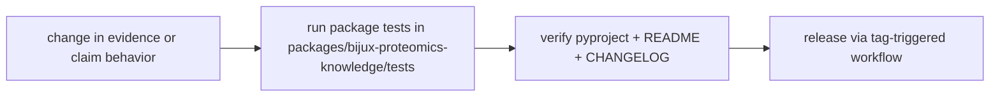

# Operations

This section is for maintainers who need to change `bijux-proteomics-knowledge`
without guessing.

Unlike `agentic-proteins`, this package is import-first. There is no published
CLI or HTTP service surface. Operational work here mostly means:

- managing package metadata and release notes
- validating library behavior with package tests
- confirming schema, evidence, and claim workflows remain stable for callers

## Visual Summary

## Pages in This Section

- [Installation and Setup](installation-and-setup.md)
- [Local Development](local-development.md)
- [Common Workflows](common-workflows.md)
- [Observability and Diagnostics](observability-and-diagnostics.md)
- [Performance and Scaling](performance-and-scaling.md)
- [Failure Recovery](failure-recovery.md)
- [Release and Versioning](release-and-versioning.md)
- [Security and Safety](security-and-safety.md)
- [Deployment Boundaries](deployment-boundaries.md)

## Read Across the Package

- [Foundation](../foundation/index.md) when you need the package boundary and ownership story first
- [Architecture](../architecture/index.md) when the question becomes structural, modular, or execution-oriented
- [Interfaces](../interfaces/index.md) when the question becomes caller-facing, schema-facing, or contract-facing
- [Quality](../quality/index.md) when the question becomes proof, risk, trust, or review sufficiency

## Concrete Anchors

- `packages/bijux-proteomics-knowledge/pyproject.toml` for package metadata
- `packages/bijux-proteomics-knowledge/README.md` for local package framing
- `packages/bijux-proteomics-knowledge/tests` for executable operational backstops
- `packages/bijux-proteomics-knowledge/src/bijux_proteomics_knowledge` for the import surface

## Use This Page When

- you are installing, running, diagnosing, or releasing the package
- you need repeatable operational anchors rather than architectural framing
- you are responding to package behavior in local work, CI, or incident pressure

## Decision Rule

Use `Operations` to decide whether a maintainer can repeat the package workflow from checked-in assets instead of memory. If a step works only because someone already knows the trick, the workflow is not documented clearly enough yet.

## What This Page Answers

- how maintainers should operate an import-first package safely
- which files must be updated together before release
- where to verify evidence/claim behavior before publishing

## Reviewer Lens

- verify that setup, workflow, and release statements still match package metadata and current commands
- check that operational guidance still points at real diagnostics and validation paths
- confirm that maintainer advice still works under current local and CI expectations

## Honesty Boundary

This page explains how `bijux-proteomics-knowledge` is expected to be operated, but it does not replace package metadata, actual runtime behavior, or validation in a real environment. A workflow is only trustworthy if a maintainer can still repeat it from the checked-in assets named here.

## Next Checks

- move to interfaces when the operational path depends on a specific surface contract
- move to quality when the question becomes whether the workflow is sufficiently proven
- move back to architecture when operational complexity suggests a structural problem

## Purpose

This page gives maintainers a reliable starting path for practical package
operations.

## Stability

This page is part of the canonical package docs spine. Keep it aligned with the current package boundary and the topic pages in this section.
