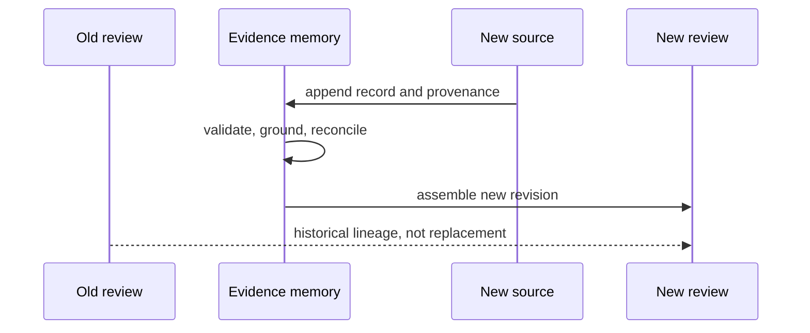

# Operating evidence workflows

Knowledge operations preserve the history needed to answer not only “what is
believed?” but “which sources, contexts, conflicts, and policies produced that
posture?” A normal workflow appends evidence, validates graph integrity,
grounds identities, reconciles relationships, and emits a versioned review.

## Common operating routes

| Work | Required review |
| --- | --- |
| ingest literature or a database extract | source identity, retrieval context, license, normalization, duplicates |
| ingest a Core or Runtime artifact | artifact digest, producer, schema, run provenance, computed versus inferred content |
| ingest a Lab outcome | assay and batch identity, observation, QC, deviation, reconciliation context |
| refresh an annotation pack | source version, changed mappings, unresolved and newly ambiguous identifiers |
| change reconciliation policy | before-and-after conflicts, selected actions, holds, downstream review differences |
| assemble a decision brief | fixed memory revision, intended use, support, contradiction, deficits, freshness |

[Common workflows](common-workflows.md) gives the detailed sequences and
[installation and setup](installation-and-setup.md) covers optional reference
and file dependencies.

## Incremental evidence updates

Do not rebuild history by overwriting records. Register the new source or
observation, link superseding material, rerun affected grounding and
reconciliation, and publish a new review revision. Preserve the previous bundle
for decisions that cite it.

## Diagnose evidence state

| Symptom | Inspect first | Likely class |
| --- | --- | --- |
| expected claim disappeared | source ingestion, normalization, graph edges | missing or invalid lineage |
| one identifier maps unexpectedly | source version, alias and organism context | ambiguous or changed grounding |
| support count increased after refresh | duplicate and derivation relationships | non-independent evidence |
| contradiction vanished | reconciliation action and context split | destructive conflict handling |
| review looks more certain than memory | sufficiency policy and unresolved deficits | review assembly error |
| consumer sees different state | memory revision and schema identity | stale or incompatible artifact |

[Observability and diagnostics](observability-and-diagnostics.md) maps these
symptoms to reports. [Failure recovery](failure-recovery.md) covers repair while
preserving lineage.

## Security and source custody

Treat external files and reference payloads as untrusted input. Record source
and license metadata, validate schema and size before ingestion, and avoid
embedding credentials or restricted material in persisted public artifacts.
See [security and safety](security-and-safety.md) and
[deployment boundaries](deployment-boundaries.md).

## Scale and determinism

Batch ingestion, graph partitioning, caching, and parallel resolution must
preserve record identity, independent lineage, conflict classification, stable
ordering where promised, and the same review result as the supported serial
path. [Performance and scaling](performance-and-scaling.md) defines the
equivalence burden.

## Release boundary

Changes to source policy, status enums, grounding, reconciliation, sufficiency,
or review schemas can alter downstream decisions even when imports remain
stable. [Release and versioning](release-and-versioning.md) requires explicit
compatibility and before-and-after review evidence for those changes.
