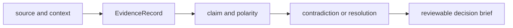

# Local development

Knowledge owns scientific memory: contextual evidence, claims, contradiction
resolution, provenance, biological mappings, coverage, and review briefs. A
local change must preserve the route from every derived statement back to its
source and context. Convenience fallbacks that erase ambiguity or provenance
are contract regressions.

## Run package-scoped gates

From the repository root, use:

```bash
make lint PACKAGE=bijux-proteomics-knowledge
make test PACKAGE=bijux-proteomics-knowledge
make quality PACKAGE=bijux-proteomics-knowledge
make api PACKAGE=bijux-proteomics-knowledge
```

Run `make build PACKAGE=bijux-proteomics-knowledge` when public exports,
packaged reference fixtures, metadata, or compatibility forwarding changes.
Keep generated evidence and reports under `artifacts/`.

## Follow evidence lineage



Begin with the owned model or resolver. Evidence and claim changes route through
`memory/models/`; graph invariants through `memory/integrity/`; conflict policy
through `memory/reconciliation/`; entity resolution through its named domain
package; and reviewer output through `reviews/`. Keep source retrieval,
curation, and persisted memory distinct so network behavior cannot silently
change evidence meaning.

## Select proof by failure mode

| Change | Required evidence |
| --- | --- |
| evidence or claim schema | valid round trip, missing context, invalid reference, and old artifact load |
| graph logic | orphan, duplicate, invalid edge, and cycle cases |
| conflict resolution | supporting, contradicting, unresolved, and escalated cases retain all inputs |
| entity mapping | resolved, ambiguous, unresolved, and source-version cases |
| freshness policy | current, stale, expired, and superseded records remain distinguishable |
| review artifact | every citation and resolution identifier reaches its source record |

Reference fixtures must record source identity, retrieval or curation date,
license posture, and version where available. A test dataset is not evidence of
current external truth unless it is explicitly governed as such.

## Preserve boundaries

Knowledge records and reconciles evidence; it does not perform Core scientific
calculations, choose Intelligence actions, or authorize Lab execution. A
mapping reports database membership or ambiguity, not pathway activity,
causality, therapeutic effect, or experimental confirmation.

The change is ready when source context survives, ambiguous and conflicting
states remain visible, graph integrity passes, persisted inputs have an
explicit compatibility result, and review outputs can be audited without
access to hidden retrieval state.
