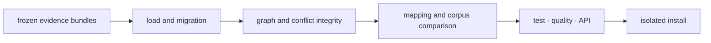

# Release and versioning

Knowledge versions are derived from repository Git tags through `hatch-vcs`.
Release evidence must establish that historical evidence remains interpretable
and that refreshed reference data is distinguishable from code behavior.

## Separate code, schema, and corpus movement

| Movement | Identity that changes | Required evidence |
| --- | --- | --- |
| implementation | package version | stable results for frozen records |
| evidence schema | schema version and package version | old load or migration proof |
| resolution policy | named policy and package version | before-and-after conflict dossier |
| reference corpus | source name, source version, and retrieval/curation identity | provenance, license, and mapping comparison |
| public export | package API | canonical and alias import proof |

A package release does not make an embedded or downloaded corpus current. A
corpus refresh does not justify changing historical resolutions in place. New
results cite the new source identity; old results remain reproducible against
their recorded source.

## Release evidence chain



Run the package gates from the repository root:

```bash
make test PACKAGE=bijux-proteomics-knowledge
make quality PACKAGE=bijux-proteomics-knowledge
make api PACKAGE=bijux-proteomics-knowledge
make build PACKAGE=bijux-proteomics-knowledge
make test PACKAGE=proteomics-knowledge
```

For reference-sensitive changes, compare resolution counts, ambiguous and
unresolved sets, source versions, and affected review briefs. A higher mapped
count is not automatically an improvement if ambiguity or provenance was lost.

## Communicate evidence impact

Update `packages/bijux-proteomics-knowledge/CHANGELOG.md` with the affected
model, resolver, policy, or corpus; persisted-data impact; mapping differences;
and consumer action. State whether prior artifacts remain readable and whether
re-running a resolution is optional, recommended, or required.

Coordinate with Intelligence when claim or brief semantics move and with Lab
when outcome evidence is promoted into memory. Knowledge remains the owner of
curation and lineage; coordination does not authorize it to choose actions or
execute assays.

After publication, install the exact wheel in an empty environment, load a
frozen evidence bundle, run an affected integrity or resolution route, and
reconstruct a decision brief. Verify `proteomics-knowledge` when curated root
exports change. Successful publication proves delivery; this replay proves
that the released memory remains auditable.
