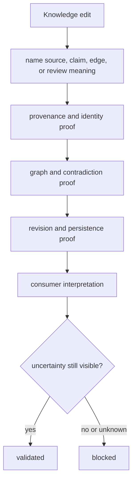

# Change validation

Validate Knowledge changes over the complete evidence chain. A schema edit is
unsafe when provenance, graph meaning, contradiction, review history, or
consumer interpretation changes even if the new record round-trips.

## Change-to-proof map

| Change | Required proof | Boundary review |
| --- | --- | --- |
| source registry or reference | identity, version/retrieval, license, duplicate, unavailable and stale cases | public citation and grounding records |
| biological mapping | exact, ambiguous, absent, obsolete, species and isoform cases | claims, joins, and downstream consumers |
| claim or evidence model | invalid/valid construction, provenance, context, confidence, immutable identity, round trip | graph and review packages |
| graph edge or traversal | endpoints, type, direction, orphan prevention, cycle policy, deterministic traversal | decision briefs and Intelligence queries |
| reconciliation rule | competing context, support, contradiction, hold, unresolved, deterministic audit | historical review state |
| confidence policy | scale, inputs, update, boundaries, missing evidence, revision | public language and Intelligence consumption |
| review or brief assembly | fixed evidence revision, complete adverse evidence, deterministic order, round trip | external and downstream reviewers |
| persistence or serialization | old/new fixtures, graph integrity, provenance, review history, rejection | all persisted-state readers |

## Validation route

Compare record counts, edge counts, contradiction sets, unresolved items,
confidence inputs, provenance, and review revisions—not only serialized bytes.
Run affected Intelligence and Lab tests when briefs, recommendations, or
feedback consume the changed state.

## Validation record

State source and retrieval context, affected identifiers, prior and new claim
or edge meaning, duplicate lineage, contradictions, confidence policy, review
revision, serialization compatibility, consumers, exact checks, and unresolved
coverage. Never replace missing evidence with a synthetic supporting record.
