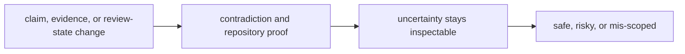

# Change Validation

Change validation should make it obvious whether a package edit is safe, risky, or mis-scoped.

## Validation Model

This page should make knowledge validation about truth-handling pressure. A
change is safe only when claim meaning, persisted state, and uncertainty
survive together under proof rather than wishful interpretation.

## Review Rules

- require proof when evidence meaning, review state, or persisted artifacts change
- run contradiction and repository checks together when durable state moves
- reject edits that make uncertainty easier to ignore

## First Proof Check

- `packages/bijux-proteomics-knowledge/tests`
- `src/bijux_proteomics_knowledge/memory/models/claims.py` and `memory/models/evidence.py`
- `src/bijux_proteomics_knowledge/memory/reconciliation/resolution.py` and `reviews/decision_briefs.py`

## Design Pressure

Knowledge validation breaks when evidence movement is easier to prove than the
meaning of uncertainty around it. The package has to keep contradiction,
storage, and review proof bound to the same change.
