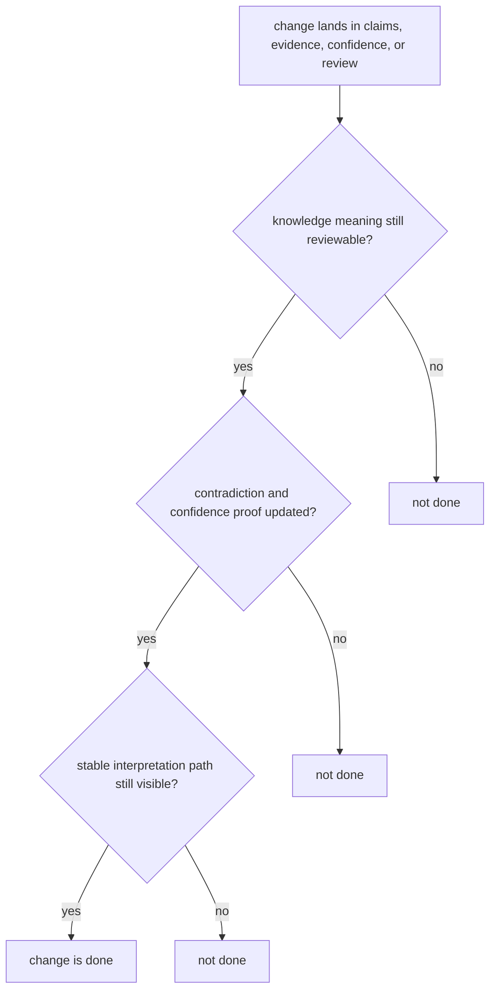

# Definition of Done

Done means the package is easier to trust after the change, not just that the diff merged.

For `bijux-proteomics-knowledge`, done means evidence, contradiction, and confidence remain inspectable enough that downstream consumers are not forced to infer hidden truth.

## Completion Model

This page exists to keep storage edits from hiding semantic drift. The package is only done when a reviewer can still explain what is known, what conflicts, and what remains uncertain.

## Review Rules

- knowledge outputs remain at least as reviewable as before
- tests and docs still reveal contradiction and confidence behavior clearly
- downstream consumers receive a stable interpretation path

## First Proof Check

- `packages/bijux-proteomics-knowledge/tests`
- `src/bijux_proteomics_knowledge/memory/models/claims.py` and `memory/models/evidence.py`
- `src/bijux_proteomics_knowledge/memory/reconciliation/resolution.py` and `reviews/packets.py`

## Design Pressure

The failure pattern here is false neatness: a change makes the stored shape simpler while making disagreement, uncertainty, or review posture harder to see.
