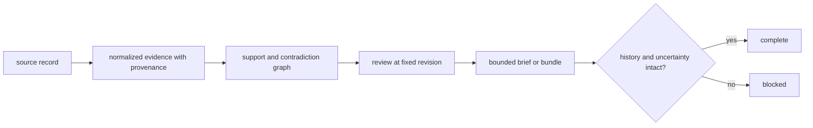

# Definition of done

A Knowledge change is complete when evidence identity, provenance, support,
contradiction, uncertainty, revision, and review disposition remain
reconstructable. A cleaner stored shape is not an improvement if it hides why a
claim is believed or disputed.

## Completion by evidence surface

| Changed surface | Required evidence | Blocking loss |
| --- | --- | --- |
| reference or registry entry | source, version or retrieval date, license posture, identifier, and duplicate handling | source custody cannot be reconstructed |
| biological identifier or mapping | exact, ambiguous, absent, obsolete, and cross-species cases | ambiguity is coerced into one identity |
| claim or evidence record | immutable identity, provenance, context, confidence meaning, and round trip | normalized text replaces the original source record |
| evidence graph | valid endpoints, support and contradiction edges, orphan prevention, and serialization | a claim survives after its evidence edge disappears |
| reconciliation rule | complete competing context, hold and unresolved cases, audit trace, and deterministic policy | conflict is resolved by order or silent overwrite |
| review state | reviewer, evidence revision, disposition, rationale, and history | later review rewrites the earlier state |
| decision brief or bundle | fixed memory revision, complete relevant evidence, deterministic assembly, and consumer boundary | downstream receives a conclusion without its adverse evidence |
| benchmark or literature grounding | citations, source scope, contradiction, freshness, and claim linkage | citation count substitutes for support quality |

## Evidence custody loop

Use focused tests under `tests/references`, `tests/memory`, `tests/reviews`, and
the relevant biological namespace. Run package grounding and serialization
guards whenever a changed record crosses into Core, Intelligence, or Lab.

## Completion record

Preserve source identity, retrieval or version context, license posture,
normalization steps, evidence and claim identifiers, graph revision, review
disposition, unresolved contradictions, and exact checks. State whether source
retrieval was repeated or only checked against retained fixtures.

## Not complete

The work remains incomplete when a missing source is replaced with placeholder
evidence, duplicate citations appear as independent corroboration, confidence
changes without a named policy, or a downstream-friendly summary drops the
contradiction that limited the original claim.
