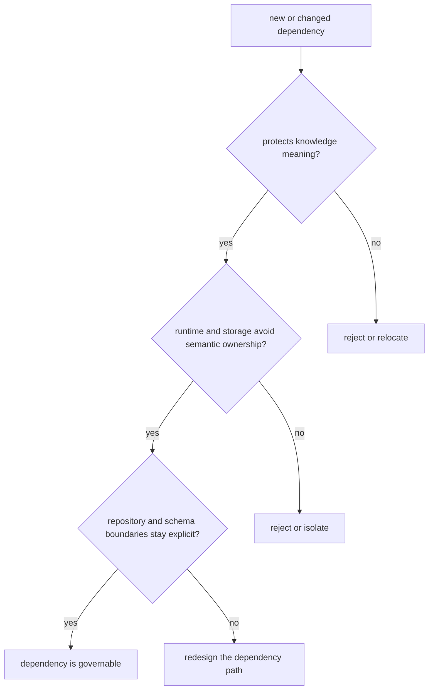

# Dependency Governance

Dependency governance is really boundary governance under another name.

For `bijux-proteomics-knowledge`, dependency review should keep semantic ownership inside the package and stop runtime or storage conveniences from becoming the real source of truth.

## Governance Model

The main job here is to keep convenience tools from rewriting what the package means. If a dependency starts deciding truth shape indirectly, the seam has already moved.

## Review Rules

- guard the line between knowledge meaning and downstream decision policy
- keep runtime and storage dependencies from becoming semantic owners
- prefer explicit repository and schema boundaries over hidden shared state

## First Proof Check

- `packages/bijux-proteomics-knowledge/tests`
- `src/bijux_proteomics_knowledge/claims.py` and `evidence.py`
- `src/bijux_proteomics_knowledge/confidence/segments.py` and `review.py`

## Design Pressure

The common failure is to accept storage or runtime convenience that quietly becomes the package’s semantic authority.
