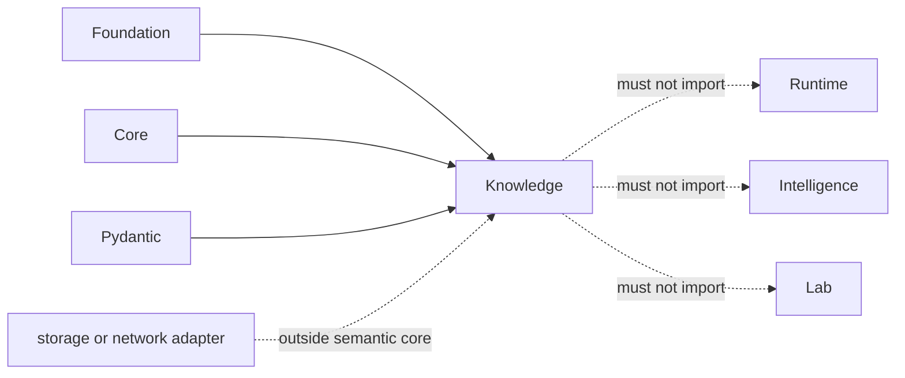

# Dependency Governance

Knowledge has a deliberately small runtime dependency set: Foundation, Core,
and Pydantic. This keeps evidence meaning independent from orchestration,
recommendation policy, laboratory actions, databases, and network clients.

## Current Dependency Contract

| Dependency | Permitted role | Prohibited authority |
| --- | --- | --- |
| `bijux-proteomics-foundation` | identifiers, provenance primitives, shared contracts | redefining those primitives in Knowledge |
| `bijux-proteomics-core` | scientific result types needed for grounding and evidence capture | invoking Knowledge as an alternate analysis engine |
| Pydantic | validation and serialization of custody records | treating schema validity as evidence validity |

The absence of a database dependency is meaningful. Persistence mechanisms
must store and retrieve the package's records without deciding claim identity,
support direction, contradiction resolution, or confidence semantics. The same
rule applies to search indexes, graph stores, HTTP clients, and ontology SDKs.

## Admission Test

A new dependency must satisfy all of these conditions:

1. It serves evidence custody, biological grounding, or review handoff.
2. The canonical claim and evidence models remain inside Knowledge.
3. Source version, retrieval context, and failure behavior can be retained.
4. Offline tests can exercise the semantic path deterministically.
5. It does not import Runtime, Intelligence, or Lab authority.
6. Missing external services degrade explicitly rather than fabricating
   evidence or silently narrowing coverage.

Adapters should translate external records into governed Knowledge contracts at
one boundary. Downstream code should consume those contracts rather than the
vendor object model.

## Rejection Signals

Reject a dependency that introduces hidden network access, global caches,
implicit ontology upgrades, database-specific truth semantics, lossy evidence
conversion, or decision policy. A convenient retrieval mechanism is not a
source of scientific authority.
