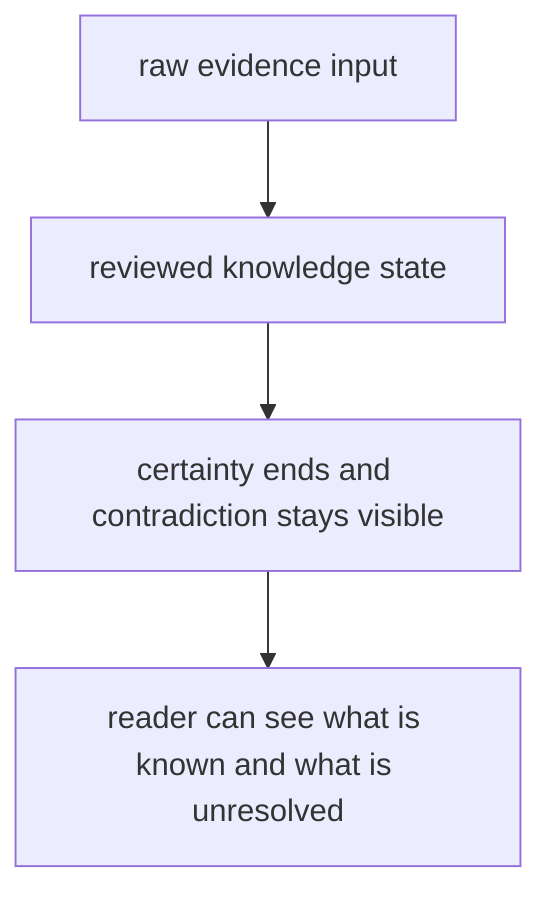

# Documentation Standards

Documentation standards should protect the reader from filler, drift, and false confidence.

For `bijux-proteomics-knowledge`, documentation should expose contradiction handling directly and show reviewed knowledge state rather than stopping at raw evidence inputs.

## Documentation Model

This page should keep knowledge docs from becoming too clean. If the prose hides where certainty ends, it stops describing the package honestly.

## Review Rules

- docs should expose contradiction handling directly
- examples should show reviewed knowledge state, not just raw evidence input
- quality pages should state where certainty ends

## First Proof Check

- `packages/bijux-proteomics-knowledge/tests`
- `src/bijux_proteomics_knowledge/memory/models/claims.py` and `memory/models/evidence.py`
- `src/bijux_proteomics_knowledge/memory/reconciliation/resolution.py` and `reviews/decision_briefs.py`

## Design Pressure

The common mistake is to document the storage path clearly while leaving contradiction handling and uncertainty boundaries vague.
