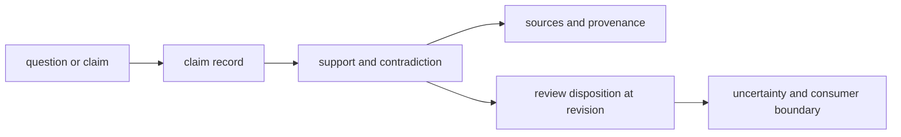

# Documentation standards

Knowledge documentation must preserve the distance between a source, an
evidence record, a claim, a review disposition, and a downstream decision.
Collapsing those layers makes uncertainty disappear from prose even when it
remains in storage.

## Evidence vocabulary

| Term | Required context | Must not imply |
| --- | --- | --- |
| **source** | origin, version or retrieval date, license posture, and stable identifier | endorsement or current correctness |
| **evidence** | source lineage, extracted statement or observation, context, and normalization | proof independent of interpretation |
| **claim** | exact proposition, scope, linked support and contradiction, and revision | settled biological truth |
| **support** | edge rationale and applicable context | corroboration if several records derive from one source |
| **contradiction** | incompatible proposition or observation and its context | automatic falsification in every context |
| **confidence** | scale, policy, inputs, and update rule | calibrated probability unless calibration is shown |
| **reviewed** | reviewer or authority, fixed evidence revision, disposition, and rationale | permanently resolved or universally accepted |
| **current** | freshness rule and checked-at time | live synchronization with every external source |

## Reader evidence chain

Start a public claim with the exact proposition and context. Then expose both
support and contradiction, source custody, freshness, and the review revision.
End with what a consumer may conclude and what remains unresolved.

## Citation and aggregation rules

Count independent evidence lineages, not repeated citations. Identify when a
review, database, and benchmark ultimately derive from the same experiment.
Preserve negative and null evidence. Explain identifier and species mapping
before aggregating records across sources.

Quotes or summaries do not replace structured provenance. A reader must be able
to reach the source identity and understand what transformation produced the
stored evidence without assuming the repository republishes restricted
content.

## Decision boundary

Knowledge describes evidence state. Intelligence owns recommendation policy,
Lab owns observed assay outcomes, and Core owns scientific computation. A
Knowledge brief may inform those owners without becoming their approval or
execution record.

[Known limitations](known-limitations.md) states the evidence ceiling, while
[definition of done](definition-of-done.md) defines custody after a change.
