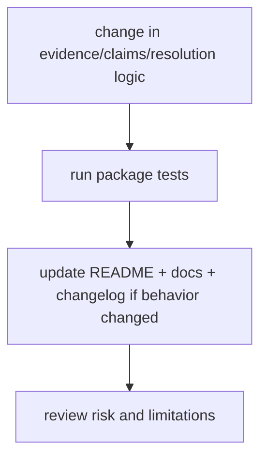

# Quality

This section explains how trust is earned for `bijux-proteomics-knowledge`
changes.

The package test layout is currently focused in `packages/bijux-proteomics-knowledge/tests`
with behavior-oriented files (claims, evidence bundles, graph, resolution,
review, schema, serialization). This section maps quality decisions to that
real proof surface.

## Visual Summary

## Pages in This Section

- [Test Strategy](test-strategy.md)
- [Invariants](invariants.md)
- [Review Checklist](review-checklist.md)
- [Documentation Standards](documentation-standards.md)
- [Definition of Done](definition-of-done.md)
- [Dependency Governance](dependency-governance.md)
- [Change Validation](change-validation.md)
- [Known Limitations](known-limitations.md)
- [Risk Register](risk-register.md)

## Read Across the Package

- [Foundation](../foundation/index.md) when you need the package boundary and ownership story first
- [Architecture](../architecture/index.md) when the question becomes structural, modular, or execution-oriented
- [Interfaces](../interfaces/index.md) when the question becomes caller-facing, schema-facing, or contract-facing
- [Operations](../operations/index.md) when the question becomes procedural, environmental, diagnostic, or release-oriented

## Concrete Anchors

- `packages/bijux-proteomics-knowledge/tests/test_claims.py`
- `packages/bijux-proteomics-knowledge/tests/test_evidence_bundle.py`
- `packages/bijux-proteomics-knowledge/tests/test_resolution.py`
- `packages/bijux-proteomics-knowledge/tests/test_review.py`

## Use This Page When

- you are reviewing tests, invariants, limitations, or ongoing risks
- you need evidence that the documented contract is actually defended
- you are deciding whether a change is truly done rather than merely implemented

## Decision Rule

Use `Quality` to decide whether `bijux-proteomics-knowledge` has actually earned trust after a change. If one narrow green check hides a wider contract, risk, or validation gap, the work is not done yet.

## What This Page Answers

- which tests currently provide direct behavior proof
- which non-test artifacts must be updated to keep reader trust
- how to judge done-ness beyond green CI

## Reviewer Lens

- compare the documented proof story with the actual test layout and release posture
- look for limitations or risks that should have moved with recent behavior changes
- verify that the claimed done-ness standard still reflects real validation practice

## Honesty Boundary

This page explains how `bijux-proteomics-knowledge` is supposed to earn trust, but it does not claim that prose alone is enough. If the listed tests, checks, and review practice stop backing the story, the story has to change.

## Next Checks

- move to foundation when the risk appears to be boundary confusion rather than missing tests
- move to architecture when the proof gap points to structural drift
- move to interfaces or operations when the proof question is really about a contract or workflow

## Purpose

This page explains how to use the quality section for `bijux-proteomics-knowledge` without repeating the detail that belongs on the topic pages beneath it.

## Stability

This page is part of the canonical package docs spine. Keep it aligned with the current package boundary and the topic pages in this section.
