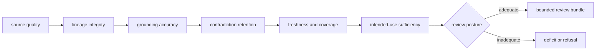

# Evidence quality

Knowledge quality is the preservation of source identity, context, independent
lineage, contradiction, uncertainty, and history across ingestion, grounding,
reconciliation, and review. A tidy conclusion is not a quality signal if the
path to it cannot be inspected.

## Quality dimensions

| Dimension | Evidence | Blocking failure |
| --- | --- | --- |
| source custody | source/version/license/retrieval fixtures | untraceable or impermissible evidence |
| normalization | round-trip and provenance tests | normalized record cannot reach its source |
| graph integrity | node, edge, orphan, cycle, and lineage checks | claims reference missing or incompatible evidence |
| grounding | known, ambiguous, unresolved, species, alias, and coordinate cases | ambiguous identity presented as unique |
| reconciliation | duplicate, conflicting, contextual, and hold cases | contradiction disappears without a recorded action |
| independence | derivation and duplicate-source analysis | copied assertions counted as separate support |
| freshness and coverage | dated source and deficit reports | stale or sparse evidence presented as comprehensive |
| review fidelity | bundle-to-memory comparison | review omits material conflict or uncertainty |

## Evidence is fit for an intended use

Quality does not reduce to one universal score. Descriptive context,
scientific interpretation, candidate prioritization, and experimental action
have different evidence burdens. The review artifact identifies the intended
use and reports whether its coverage, directness, contradiction, and freshness
meet that burden.

An unresolved result is high-quality when the available evidence genuinely
cannot resolve the question and the deficit is precise. A confident scalar
answer can be low-quality when its source and context are missing.

## Proof by change type

| Change | Minimum proof |
| --- | --- |
| source connector | provenance, malformed input, license metadata, duplicate handling |
| identifier resolver | known, ambiguous, unresolved, alias, organism, and source-version cases |
| biological relationship | positive, negative, contextual, coverage, and stale-source cases |
| reconciliation policy | every action, competing contexts, hold, history, before-and-after bundle |
| evidence or claim model | schema compatibility, graph integrity, serialization, consumer impact |
| review workflow | fixed memory revision, complete support and contradiction, deterministic assembly |

[Test strategy](test-strategy.md) and [change validation](change-validation.md)
map these proof obligations to package and repository checks.

## Invariants

- evidence history is append-only in meaning;
- normalized records retain original provenance;
- claims do not outlive or lose their evidence edges;
- ambiguity, contradiction, staleness, and missing coverage remain explicit;
- evidence duplication is not mistaken for independent corroboration;
- review bundles name their memory revision and assembly policy;
- downstream recommendations cannot mutate Knowledge truth.

The complete contract is in [invariants](invariants.md).

## Active limitations and risk

External sources may be incomplete, stale, biased, unavailable, or differently
licensed. Identifier and biological relationship coverage varies by species and
context. Automated reconciliation cannot settle every conflict. These limits
belong in [known limitations](known-limitations.md) and unresolved ownership or
review risks belong in the [risk register](risk-register.md), not in hidden
fallback behavior.

## Review route

Use [dependency governance](dependency-governance.md) for reference and parsing
dependencies, [documentation standards](documentation-standards.md) for public
evidence language, and [review checklist](review-checklist.md) before handoff.
[Definition of done](definition-of-done.md) requires both passing evidence and
an explicit record of remaining gaps.
