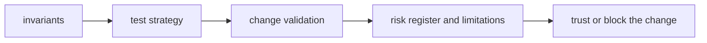

# Quality

`bijux-proteomics-knowledge` quality should tell a reviewer what must remain true, what proof is required, and which risks are serious enough to block a change.

## Trust Model

This page should frame knowledge quality as canonical evidence pressure. The
package remains trustworthy when claims, confidence, contradiction handling,
and review state stay explicit enough for others to consume without guessing.

## Start With

- open [Invariants](https://bijux.io/bijux-proteomics/06-bijux-proteomics-knowledge/quality/invariants/) before changing package meaning
- open [Change Validation](https://bijux.io/bijux-proteomics/06-bijux-proteomics-knowledge/quality/change-validation/) when you need the minimum proof for a real edit
- open [Risk Register](https://bijux.io/bijux-proteomics/06-bijux-proteomics-knowledge/quality/risk-register/) when the package boundary feels under pressure

## Section Pages

- [Invariants](https://bijux.io/bijux-proteomics/06-bijux-proteomics-knowledge/quality/invariants/)
- [Test Strategy](https://bijux.io/bijux-proteomics/06-bijux-proteomics-knowledge/quality/test-strategy/)
- [Change Validation](https://bijux.io/bijux-proteomics/06-bijux-proteomics-knowledge/quality/change-validation/)
- [Definition of Done](https://bijux.io/bijux-proteomics/06-bijux-proteomics-knowledge/quality/definition-of-done/)
- [Dependency Governance](https://bijux.io/bijux-proteomics/06-bijux-proteomics-knowledge/quality/dependency-governance/)
- [Documentation Standards](https://bijux.io/bijux-proteomics/06-bijux-proteomics-knowledge/quality/documentation-standards/)
- [Known Limitations](https://bijux.io/bijux-proteomics/06-bijux-proteomics-knowledge/quality/known-limitations/)
- [Review Checklist](https://bijux.io/bijux-proteomics/06-bijux-proteomics-knowledge/quality/review-checklist/)
- [Risk Register](https://bijux.io/bijux-proteomics/06-bijux-proteomics-knowledge/quality/risk-register/)

## What Quality Means Here

- proving that evidence, claims, confidence, and contradiction handling remain canonical and reviewable

## First Proof Check

- `packages/bijux-proteomics-knowledge/tests`
- `src/bijux_proteomics_knowledge/memory/models/claims.py` and `memory/models/evidence.py`
- `src/bijux_proteomics_knowledge/memory/reconciliation/resolution.py` and `reviews/packets.py`

## Design Pressure

Knowledge quality weakens when contradiction and uncertainty handling become
harder to inspect than the claims they protect. The section has to keep truth
and reviewability linked.
