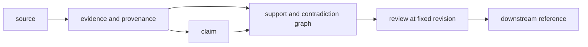

# Invariants

Knowledge invariants preserve the difference between source material,
normalized evidence, claims, relationships, review state, and downstream
decisions. That separation keeps disagreement and uncertainty inspectable.

## Evidence-custody invariants

| Invariant | What remains true | Observable violation |
| --- | --- | --- |
| source identity is immutable | origin, version or retrieval date, license posture, and source identifier survive normalization | a citation cannot be traced to the retrieved record |
| evidence preserves context | extraction, species, sample, method, condition, and transformation remain attached where relevant | statement is reused outside the context that supported it |
| claims are exact propositions | scope and revision are stable and distinct from display summaries | editing prose silently changes claim identity |
| graph edges are explicit | support, contradiction, derivation, and context relationships name valid endpoints and rationale | claim remains after its evidence edge disappears |
| contradiction is durable | conflicting records and context survive reconciliation | later evidence overwrites adverse evidence |
| confidence is policy-bound | scale, inputs, update rule, and revision remain reviewable | stored confidence changes with no decision record |
| lineage governs corroboration | duplicates and shared upstream sources do not masquerade as independent support | repeated database copies inflate evidence strength |
| review is revision-specific | reviewer, evidence revision, disposition, rationale, and unresolved items remain attached | later review rewrites the earlier conclusion |
| serialization preserves meaning | graph, claims, evidence, provenance, and review state round-trip together | stored state loses uncertainty or relationship type |
| downstream use is non-mutating | Intelligence and Lab reference Knowledge state and append outcomes | a recommendation edits the evidence record that justified it |

## Context is part of meaning

Species, isoform, condition, cohort, method, time, and source lineage can turn
apparent agreement into non-comparable evidence. Normalization may make records
joinable; it must not erase the context needed to decide whether they should be
joined.

## Failure response

Reject invalid edges and orphan records. Preserve unresolved contradiction and
ambiguous mappings. Create a new claim or review revision when meaning changes.
Do not repair graph integrity by dropping adverse evidence or assigning a
convenient identifier.
