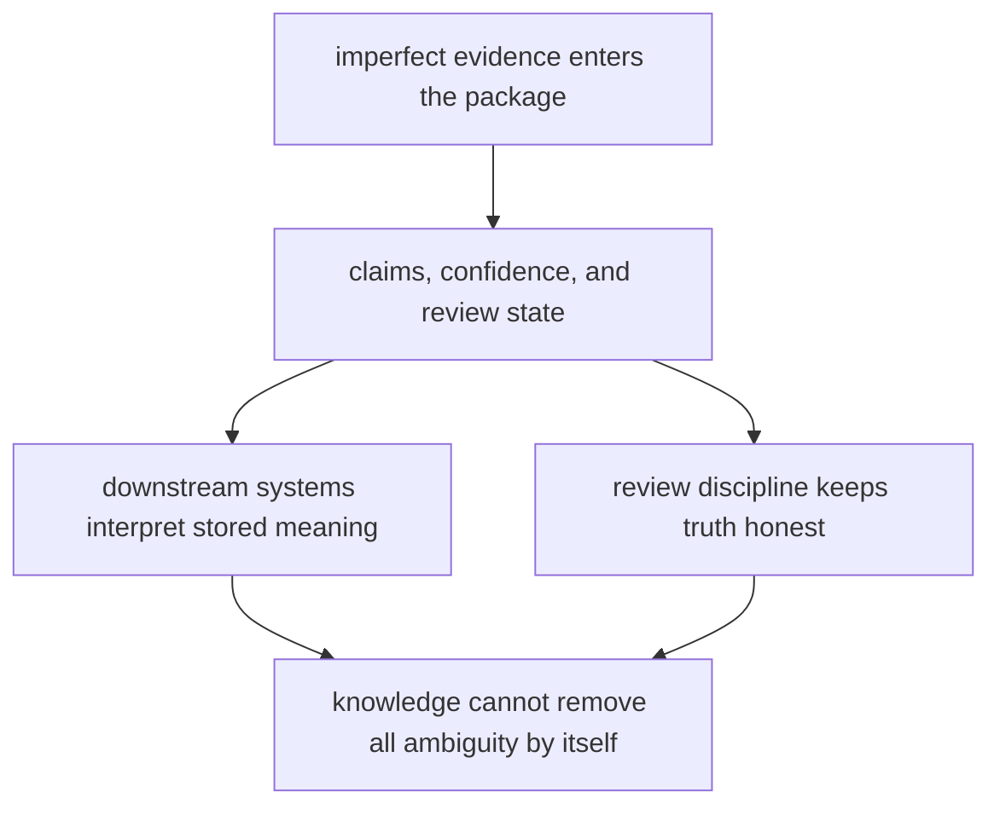

# Known Limitations

Known limitations matter because honest boundaries are part of quality, not an admission of failure.

For `bijux-proteomics-knowledge`, limitations are mostly about uncertainty: the package can preserve disagreement and review state, but it cannot automatically resolve them into simple truth.

## Limitation Model

This page should remind readers that persistence is not resolution. The package can make ambiguity inspectable, but it cannot guarantee that every consumer reads that ambiguity carefully.

## Review Rules

- the package cannot resolve all evidence ambiguity automatically
- canonical meaning still depends on careful downstream consumption
- persisted knowledge is only as trustworthy as the review discipline behind it

## First Proof Check

- `packages/bijux-proteomics-knowledge/tests`
- `src/bijux_proteomics_knowledge/memory/models/claims.py` and `memory/models/evidence.py`
- `src/bijux_proteomics_knowledge/memory/reconciliation/resolution.py` and `reviews/packets.py`

## Design Pressure

The easy failure is to mistake well-structured stored state for settled truth when the real condition is still uncertainty plus review discipline.
