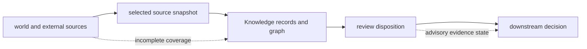

# Known limitations

Knowledge can preserve evidence and disagreement more faithfully than an
unstructured summary. It cannot guarantee complete literature coverage,
perfect biological identity resolution, source availability, or a final answer
to every contradiction.

## Evidence limits

| Limitation | Consequence | Responsible interpretation |
| --- | --- | --- |
| external databases and literature change on independent schedules | retained evidence can become stale without becoming structurally invalid | publish source version or retrieval date and freshness status |
| licensing and redistribution differ by source | a reference can be reviewable without its full upstream content being bundled | follow the source link and license record; do not infer local custody |
| protein, gene, isoform, ortholog, pathway, disease, drug, and complex identifiers are context-dependent | normalization can merge or split biologically distinct entities | retain namespace, species, isoform, mapping method, and ambiguity |
| source coverage is selective | absence from the graph is not evidence of biological absence | state the registries, corpora, and queries searched |
| several records may share one underlying experiment or database | record count can exaggerate independent support | inspect lineage before treating evidence as corroboration |
| contradiction can reflect context, method, population, or time | automated reconciliation may not yield one defensible truth | preserve competing contexts and use unresolved or hold dispositions |
| confidence depends on declared policy and inputs | it is not automatically a calibrated probability | report the scale and update rule with the value |
| retained fixtures prove deterministic handling of checked records | they do not prove that remote retrieval still succeeds or returns unchanged content | distinguish fixture replay from live-source verification |

## Knowledge boundary

The package can state what its selected sources support, contradict, or leave
uncertain at a named revision. It cannot claim exhaustiveness unless the search
space and retrieval result make that claim testable.

## Report a grounded gap

Name the missing source class, unresolved identifier, stale retrieval, shared
lineage, or contradiction context. “No evidence found” must include where and
how the search was performed. “Reviewed” must include the evidence revision and
disposition. Downstream recommendations remain bounded by these gaps even when
their own policy is deterministic.
