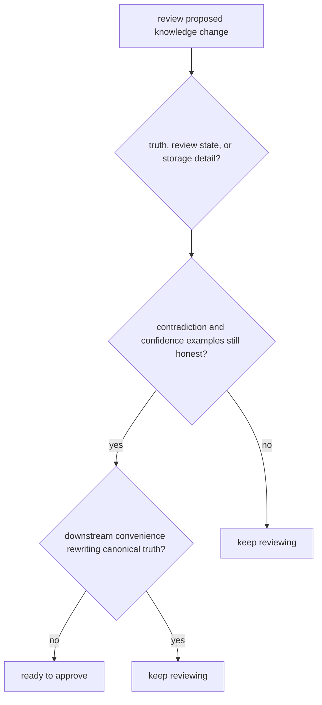

# Review Checklist

A review checklist is useful only if it catches the real ways this package can drift.

For `bijux-proteomics-knowledge`, review should distinguish semantic change from storage change before any confidence comes from green checks.

## Review Model

The checklist exists so a cleaner persistence shape does not get mistaken for a safer truth model.

## Review Rules

- ask whether the change affects evidence meaning, review meaning, or only storage shape
- check contradiction and confidence examples before approving
- verify that downstream convenience is not rewriting canonical truth

## First Proof Check

- `packages/bijux-proteomics-knowledge/tests`
- `src/bijux_proteomics_knowledge/memory/models/claims.py` and `memory/models/evidence.py`
- `src/bijux_proteomics_knowledge/memory/reconciliation/resolution.py` and `reviews/packets.py`

## Design Pressure

The common drift is to approve a storage or ergonomics change that quietly changes what downstream systems are allowed to believe.
