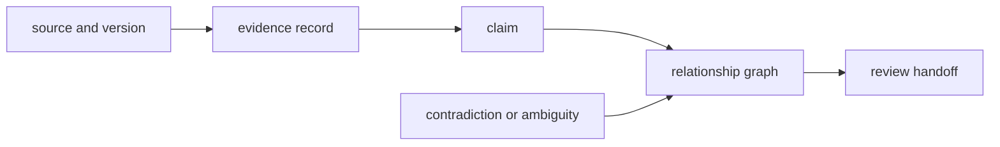

# Risk Register

Knowledge failures often preserve valid-looking records while corrupting what
readers are allowed to infer. The risk surface spans identity, source custody,
relationship direction, uncertainty, reconciliation, coverage, and downstream
interpretation.

## Scientific And Custody Risks

| Risk | Observable failure | Required control |
| --- | --- | --- |
| identity ambiguity | one symbol resolves to the wrong protein, species, or isoform | namespace, organism, version, and ambiguity status |
| source drift | a database or ontology changes without a retained version | source release and retrieval provenance |
| citation decay | source is retracted, moved, or no longer supports the claim | citation context, freshness review, explicit invalidation |
| relationship inversion | supports/refutes, drug/target, kinase/substrate, or parent/child direction reverses | typed directed edges and asymmetric tests |
| evidence laundering | derived interpretation is stored as primary evidence | evidence class and derivation lineage |
| contradiction erasure | reconciliation drops a dissenting record | retain competing evidence and resolution rationale |
| confidence conflation | source confidence becomes claim or decision confidence | separate confidence dimensions and owners |
| reconciliation instability | input order changes the resolved record | deterministic resolution and retained alternatives |
| graph corruption | dangling, duplicate, or unreachable evidence enters memory | graph-integrity validation |
| coverage overclaim | “not represented” is read as “biologically absent” | denominator, source scope, and unresolved set |
| schema drift | old persisted evidence changes meaning on load | compatibility evaluation and migration evidence |
| review-state divergence | a brief no longer matches canonical stored evidence | content fingerprint or regeneration check |
| redistribution error | external content is shipped beyond its license | source-specific licensing and distribution boundary |
| downstream reinterpretation | consumers assign new meaning to canonical fields | typed handoff contracts and cross-package tests |

## Review Priority

Prioritize failures that change meaning without breaking serialization:
namespace defaults, relationship direction, source versions, uncertainty
coercion, and reconciliation policy. Test contradictory evidence, unresolved
identifiers, stale sources, duplicate relationships, empty coverage, and old
serialized records.

A trustworthy handoff preserves not only the accepted record but also why it
was accepted, what competed with it, and which uncertainty remains.
