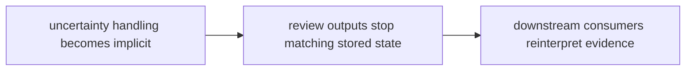

# Risk Register

A risk register should name the structural and behavioral failures that deserve ongoing attention.

## Risk Model

This page should make knowledge risk feel like truth drift under uncertainty.
The package is in trouble when stored state, review outputs, and downstream
understanding stop lining up.

## Review Rules

- uncertainty handling becomes implicit
- review outputs stop matching stored knowledge state
- downstream consumers silently reinterpret canonical evidence

## First Proof Check

- `packages/bijux-proteomics-knowledge/tests`
- `src/bijux_proteomics_knowledge/memory/models/claims.py` and `memory/models/evidence.py`
- `src/bijux_proteomics_knowledge/memory/reconciliation/resolution.py` and `reviews/packets.py`

## Design Pressure

Knowledge risk escalates when uncertainty is still present but no longer
visible in the output readers consume. The register has to keep truth,
uncertainty, and persistence drift in one frame.
