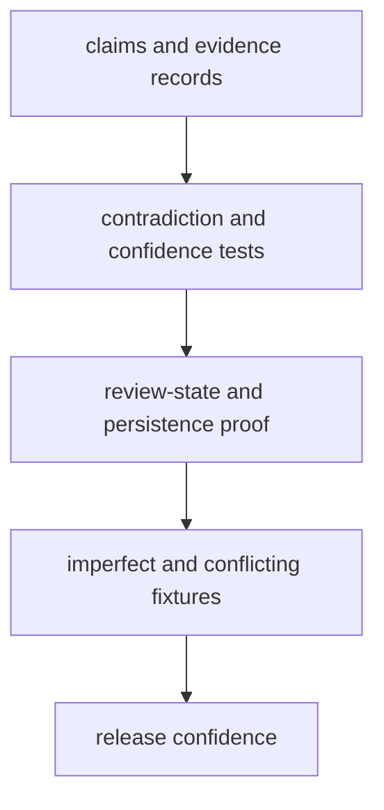

# Test Strategy

A useful test strategy names what evidence is needed and why shallow coverage is not enough.

For `bijux-proteomics-knowledge`, the test story should show how the package handles imperfect evidence without hiding contradiction, confidence, or review-state drift.

## Strategy Model

This page should make it obvious that the package is not defending one ideal path. The real proof comes from preserving meaning under messy evidence and stored-state pressure.

## Review Rules

- favor contradiction, confidence, and review-state tests over generic coverage claims
- cover persistence cases where knowledge meaning could drift silently
- use fixtures that show imperfect or conflicting evidence, not just ideal cases

## First Proof Check

- `packages/bijux-proteomics-knowledge/tests`
- `src/bijux_proteomics_knowledge/memory/models/claims.py` and `memory/models/evidence.py`
- `src/bijux_proteomics_knowledge/memory/reconciliation/resolution.py` and `reviews/packets.py`

## Design Pressure

The common drift is to optimize for storage or coverage shape while leaving contradiction handling and downstream interpretation less clearly defended.
