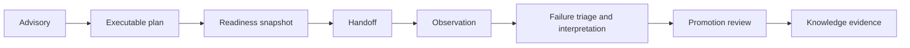

# Architecture Risks

Lab risk begins when a recommendation, plan, readiness assessment, completed run, or promoted outcome is treated as if it proves all the others.

| Risk | Consequence | Control |
| --- | --- | --- |
| Advisory-to-execution collapse | Scientifically useful work is scheduled without operational review | Keep advisory plans non-executable and require explicit executable plans |
| Stale readiness | Capacity, inventory, staffing, controls, or backlog changes after approval | Bind readiness to a dated snapshot and re-evaluate before handoff |
| Dependency failure | An assay starts before prerequisite evidence or work exists | Validate dependency integrity and cycles |
| Missing controls | Results cannot distinguish signal from technical or procedural artifact | Make control absence blocking for affected batches |
| Provenance gap | Observations cannot be traced to approved intent, inputs, or operators | Gate execution and promotion on lineage completeness |
| Failure-class collapse | Technical failure is interpreted as biological failure, or vice versa | Preserve normalized result state and failure class |
| Censoring blindness | Below-detection measurements are treated as ordinary quantitative values | Retain detection limit, direction, and censoring flag |
| Promotion leakage | Raw or weak observations enter knowledge as accepted evidence | Require a separate promotion review and normalized evidence contract |
| Queue bias | Candidate score crowds out cost, capacity, evidence gaps, and assay burden | Preserve prioritization factors and queue rationale |

The gates deliberately repeat validation at changing boundaries. A scientifically justified assay can remain operationally irresponsible, and a well-executed assay can remain evidentially inconclusive.

## Review before evidence promotion

| Promotion question | Required evidence | Blocking outcome |
| --- | --- | --- |
| did authorized work produce this observation? | plan, handoff, custody, operator, sample, batch, and artifact lineage | missing or conflicting provenance |
| was the measurement technically valid? | controls, QC, calibration, detection limits, censoring, deviations, and acceptance policy | technical or uninterpretable failure |
| is the result repeatable enough for its intended use? | replicate, batch, dispersion, missingness, and reproducibility assessment | unresolved reproducibility failure |
| what proposition can the observation address? | requested question, measured entity, direction, magnitude, context, and granularity | observation does not answer the claim being promoted |
| how should adverse or null evidence be represented? | failure class, uncertainty, context, and relationship to the requested result | pressure to omit a valid non-confirming outcome |
| who accepts the evidence relationship? | named reviewer, promotion policy, decision, limitations, and destination Knowledge identity | no accountable evidence authority |

Promotion may accept, qualify, contradict, reject, or hold an observation. It
must not convert technical failure into biological evidence, hide a valid null
result, or strengthen the original recommendation merely because the assay was
completed.
