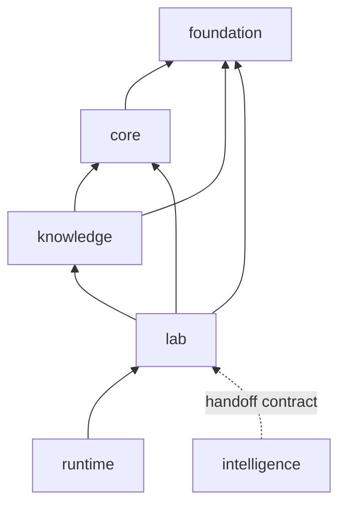

# Dependency Direction

Lab depends on foundation, core, and knowledge. It deliberately has no required dependency on intelligence or runtime: decision support can arrive through bounded handoff records, and operational infrastructure can execute approved plans without becoming part of their scientific meaning.

## Import rules

- Foundation supplies identifiers, schema metadata, canonical models, and shared outcome semantics.
- Core supplies program, assay, workflow-blueprint, and scientific QC contracts.
- Knowledge supplies evidence bundles, trust, gaps, contradictions, triangulation, and normalized evidence inputs.
- Intelligence recommendations may be summarized as lab-facing signals, but lab does not import intelligence policy or treat its score as execution authority.
- Runtime may persist, schedule, or serve lab operations. Lab code remains independent of runtime processes, queues, and HTTP state.

## Advisory and operational authority

Evidence can justify an advisory assay recommendation. It cannot by itself establish instrument availability, material sufficiency, staffing, controls, provenance completeness, budget, or review clearance. Those conditions belong to lab readiness. Keeping this distinction inside the package boundary prevents a scientifically attractive next step from becoming an executable instruction by serialization accident.

## Return path to knowledge

Observed assays are normalized with QC state, replicate information, uncertainty, failure class, and lineage. Promotion into knowledge is a separate lifecycle decision. A technical failure, biological failure, reproducibility failure, or inconclusive result may all be valuable evidence, but each has a different meaning and must retain that meaning when handed back.
