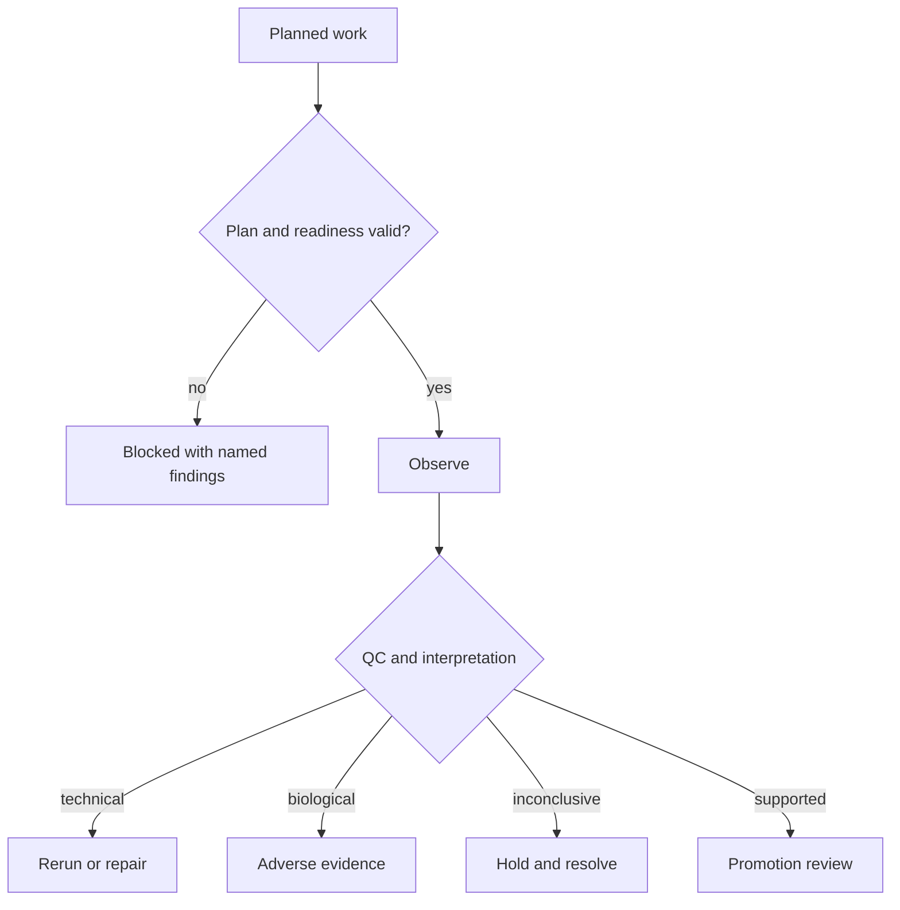

# Error Model

Lab represents planning blockers, operational failures, scientific outcomes, and promotion conflicts separately because each demands a different response.

| Condition | Representation | Response |
| --- | --- | --- |
| Invalid design | Experiment design or plan validation issue | Correct cohorts, controls, assays, dependencies, or metadata |
| Dependency cycle | Dependency cycle or integrity report | Repair the plan before scheduling |
| Resource blocker | Readiness report naming instruments, materials, staffing, cost, or backlog | Defer or re-plan; do not mark execution ready |
| Missing control or provenance | Readiness blocker or artifact contract issue | Restore the required control or lineage before handoff |
| Transition refusal | Approved, exploratory, or refused targeted-transition disposition | Restrict or reject the transition with reasons |
| Technical failure | `FAILED_TECHNICAL` and technical failure class | Diagnose execution and apply the declared rerun policy |
| Reproducibility failure | `FAILED_REPRODUCIBILITY` | Review dispersion, batches, protocol, and repeats |
| Biological failure | `FAILED_BIOLOGICAL` | Retain as interpretable adverse evidence; do not relabel as technical |
| Inconclusive outcome | `INCONCLUSIVE` with uncertainty and caveats | Hold promotion or request resolving work |
| Promotion conflict | Blocked promotion state or audit issue | Preserve the observation and resolve the promotion gate |

A failed acceptance rule does not identify the failure class by itself. QC, replicate behavior, controls, material state, censoring, and protocol context determine whether the correct response is rerun, redesign, adverse-evidence promotion, or refusal to interpret.

## Build a failure-classification packet

| Evidence | Question it answers |
| --- | --- |
| approved plan and handoff | what question, protocol, controls, materials, and acceptance criteria were authorized? |
| custody and execution record | which samples, batches, instruments, operators, timings, and deviations belong to the observation? |
| raw and processed measurements | what was observed before and after declared transformation? |
| control and QC outcomes | did positive, negative, process, reference, and system controls behave as required? |
| replicate and batch behavior | is the result repeatable, dispersed, censored, or associated with one batch? |
| material and protocol state | were identity, integrity, storage, preparation, and procedural requirements satisfied? |
| detection and acceptance limits | was absence distinguishable from below-detection, saturation, or an invalid measurement? |
| classification and authority | who assigned technical, reproducibility, biological, inconclusive, or uninterpretable status, and under which policy? |

The packet supports one response: rerun unchanged, repair and rerun, redesign,
accept adverse biological evidence, hold, or refuse interpretation. A rerun is
not the default for biological failure, and promotion is not available while
technical validity or provenance remains unresolved.
