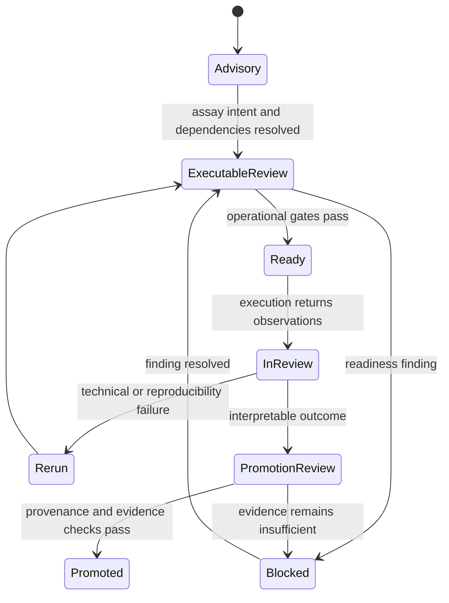
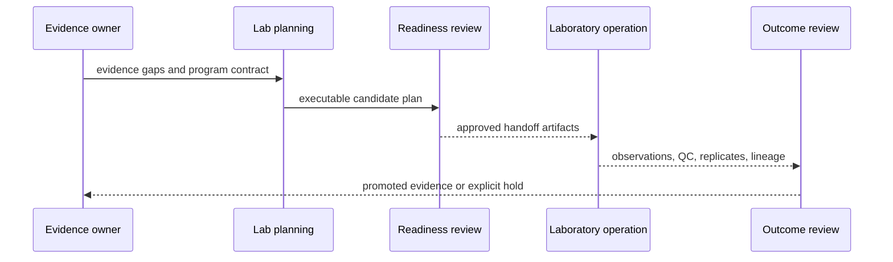

# Execution Model

The lab loop advances through explicit contracts. Advisory planning answers what evidence would be useful. Executable planning answers whether a concrete batch can be handed to operators. Outcome handling answers what happened and whether the result is fit to return to knowledge.

## From evidence gap to batch

Planning maps open evidence needs to assays, prerequisites, sample kinds, blocking gates, and ordered batches. Advisory plans remain `executable = false`. Building an executable plan adds concrete instruction and batch identities plus preflight checks, but `ready_for_execution` still reflects blockers rather than bypassing them.

Readiness evaluates live constraints: instrument and material availability, capacity, staffing, cost, backlog pressure, required controls, input lineage, and evidence strength. The report names deferred batches and blocking resources. Warning and blocking provenance findings remain distinguishable.

## Handoff and observation

Handoff artifacts freeze the approved intent and explain risks, controls, and expected outputs. Physical execution occurs outside this Python package. Returned observations are judged against assay definitions and acceptance rules, then classified as passed, biological failure, technical failure, reproducibility failure, or inconclusive.

## Reconciliation and audit

Rerun policy follows the failure class rather than a generic failed flag. Review-queue and assay-lifecycle transitions are validated and timestamped; broken histories are audit findings. Promotion is separately recorded as pending, ready, blocked, promoted, or superseded. This makes the full loop reviewable without pretending that planning, execution, interpretation, and evidence acceptance are the same event.
