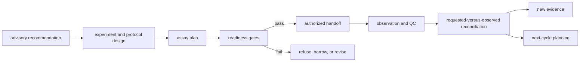
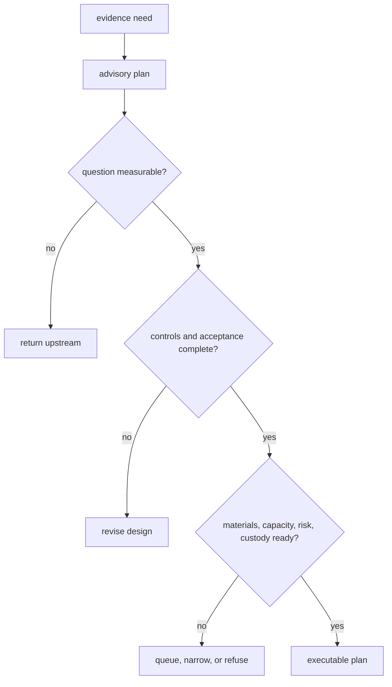

# Laboratory consequence architecture

`bijux-proteomics-lab` translates an advisory scientific action into a bounded
assay plan, tests operational readiness, records an authorized handoff, captures
observations and QC, and reconciles the outcome with the original question. It
does not execute a generic workflow engine or grant itself scientific authority.

## Responsibility map

| Family | Owns | Keeps distinct |
| --- | --- | --- |
| `design` | experiment and protocol contracts | scientific relevance versus operational completeness |
| `planning` | advisory and executable plans, priorities, queues, batches, schedules, next cycle | priority versus authorization |
| `readiness` | stage and operational checks | ready, blocked, refused, and conditionally ready states |
| `handoffs` | artifacts, explanations, authority, risk, exports, transitions, PTM and QC feedback | plan identity versus transferred instructions |
| `outcomes` | observations, acceptance, failure, reliability, evidence feedback | measurement versus interpretation |
| `lifecycle` | governed progression | recorded state versus allowed transition |
| `reconciliation` | requested-versus-observed disposition and follow-up | supported, weakened, rejected, inconclusive, rerun |
| `benchmarks` | claim, rehearsal, learning, follow-up, outcome-dossier evidence | rehearsal versus production consequence |

The [module map](module-map.md) resolves these responsibilities to source
owners. [Dependency direction](dependency-direction.md) preserves the one-way
flow from upstream records into Lab consequence.

## Advisory and executable plans

An advisory plan describes valuable follow-up while preserving missing
operational detail. An executable plan clears the stronger readiness contract:
protocol, samples, materials, controls, instrumentation, acceptance criteria,
risk, ownership, and outcome reconciliation are actionable.

## Handoff and authority

A handoff binds assay, batch, sample, protocol, control, material, acceptance,
and operator identities. It preserves unresolved risks and preconditions.
Human governance remains the authorization owner; Lab records the authority and
instructions rather than inferring approval from a high-ranked recommendation.

[Integration seams](integration-seams.md) covers Intelligence input, Runtime or
external execution custody, Knowledge feedback, and LIMS-oriented exports.

## Observation and reconciliation

Observation is a factual record of measurement, QC, deviation, missingness, and
failure. Reconciliation applies the requested endpoint and acceptance criteria
to classify what the observation means for follow-up. This separation allows a
technically successful assay to remain scientifically inconclusive.

[State and persistence](state-and-persistence.md) defines append-only plan,
handoff, and outcome lineage. [Execution model](execution-model.md) traces
progression without treating process completion as evidence promotion.

## Extension rules

A new assay plan belongs with planning; a new readiness burden belongs with
readiness; a new transfer representation belongs with handoffs; a new measured
fact belongs with outcomes; a new requested-versus-observed policy belongs with
reconciliation. Extensions retain stable identifiers and cannot move upstream
recommendation or evidence policy into Lab.

Use [extensibility model](extensibility-model.md) and
[error model](error-model.md) for typed refusal, failure, and progression.

## Architectural risks

The highest risks are advisory plans treated as instructions, schedules that
hide unmet dependencies, incomplete controls, handoffs without authority or
custody, observed values detached from QC, and feedback that edits upstream
history. [Architecture risks](architecture-risks.md) and
[code navigation](code-navigation.md) provide the review routes.
