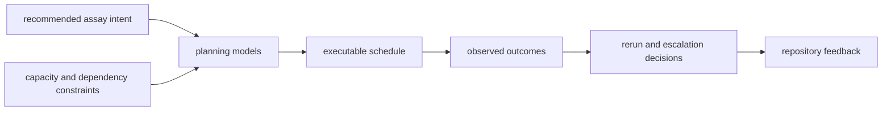

# Architecture

`bijux-proteomics-lab` architecture is where recommendation intent becomes
workable assay reality. This section should help a reader see how planning,
scheduling, outcomes, and feedback loops operate under lab constraints without
pulling decision policy or shared meaning into the wrong layer.

## Architectural Promise

- the lab package should make operational reality explicit rather than implicit
- schedule decisions should stay traceable back to assay requirements and
  constraints
- outcome interpretation should feed back into the wider system without stealing
  program authority

## Start With

- open [Execution Model](https://bijux.io/bijux-proteomics/07-bijux-proteomics-lab/architecture/execution-model/)
  when the question is how intent becomes schedules and then outcomes
- open [Integration Seams](https://bijux.io/bijux-proteomics/07-bijux-proteomics-lab/architecture/integration-seams/)
  when a change risks importing recommendation policy or shared payload meaning
  into lab logic
- open [Module Map](https://bijux.io/bijux-proteomics/07-bijux-proteomics-lab/architecture/module-map/)
  when you need the owner for planning, repositories, outcomes, or schema code

## Read By Workflow Moment

- before execution:
  [Module Map](https://bijux.io/bijux-proteomics/07-bijux-proteomics-lab/architecture/module-map/)
  and [Execution Model](https://bijux.io/bijux-proteomics/07-bijux-proteomics-lab/architecture/execution-model/)
- during persistence and handoff:
  [State and Persistence](https://bijux.io/bijux-proteomics/07-bijux-proteomics-lab/architecture/state-and-persistence/)
  and [Code Navigation](https://bijux.io/bijux-proteomics/07-bijux-proteomics-lab/architecture/code-navigation/)
- when expanding lab behavior:
  [Extensibility Model](https://bijux.io/bijux-proteomics/07-bijux-proteomics-lab/architecture/extensibility-model/)
  and [Architecture Risks](https://bijux.io/bijux-proteomics/07-bijux-proteomics-lab/architecture/architecture-risks/)

## First Proof Check

- `src/bijux_proteomics_lab/planning.py` and `outcomes.py` for the lab-facing control flow
- `src/bijux_proteomics_lab/schema.py` and `serialization.py` for contract structure
- `src/bijux_proteomics_lab/repositories.py` for durable storage boundaries

## Boundary Test

If a schedule decision cannot be explained in terms of assay intent,
dependencies, and observed outcomes, the architecture is not telling the truth
about the package.
