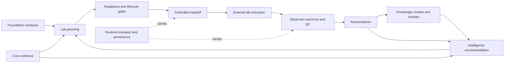

# Integration Seams

Lab is the authority for operational readiness and assay handoff, not for discovering scientific signals or controlling instruments. The central integration contract is a closed, reviewable loop: recommendation enters with evidence; execution leaves with controls; observation returns with provenance; reconciliation informs the next decision.

## Producer and consumer obligations

| Seam | Incoming contract | Lab-owned decision | Boundary |
| --- | --- | --- | --- |
| Foundation → Lab | identifiers, JSON models, provenance, outcomes, and compatibility primitives | operational models constructed from shared contracts | Lab does not redefine common identity or serialization semantics |
| Core → Lab | measured candidates, uncertainty, design context, and assay-relevant evidence | whether evidence needs can be mapped to concrete wet-lab actions | Lab does not rerun discovery algorithms or upgrade weak measurements |
| Knowledge → Lab | resolved entities, curated context, coverage, conflicts, and citations | which caveats and controls must survive into the handoff | a reference association is not proof of feasibility |
| Intelligence → Lab | bounded recommendation, rationale, expected information gain, and unresolved uncertainty | practicality, priority, burden, readiness, scheduling, and refusal | ranking is advisory until Lab evaluates operational constraints |
| Lab → external execution | executable plan, protocol version, samples, controls, caveats, field mapping, and artifact integrity | whether the packet is responsible and complete enough to deliver | instrument control and physical execution remain external |
| External execution → Lab | observations, run QC, failures, protocol context, and artifact identity | acceptance, rerun, reliability, and promotion readiness | missing or failed observations are not converted into success |
| Lab → Knowledge/Intelligence | provenance-preserving evidence candidates and planned-versus-observed feedback | operational interpretation of what happened and what should be reconsidered | Lab does not curate scientific truth or set advisory policy |
| Runtime ↔ Lab | persistence, queues, transport, and execution envelopes | semantic validation of Lab artifacts | Runtime carries state but does not own readiness or promotion decisions |

## Gate sequence

Scientific merit is necessary but insufficient. The design gate checks replication, contrasts, randomization, layout, and controls. The readiness gate checks evidence, provenance, materials, staffing, capacity, and backlog. The handoff gate checks risk, protocol attachments, authority, serialization integrity, and export loss. The outcome gate checks acceptance rules, QC, reliability, and failure class before any promotion.

Each gate can refuse progression with structured reasons. A refusal is a valid operational result: it preserves why work could not responsibly proceed and what evidence or control would change the decision.

## Round-trip integrity

The plan, exported packet, observed result, and reconciliation report must remain linkable. Canonical artifact envelopes detect payload drift; LIMS mappings disclose fields that cannot be represented; outcome records retain requested-versus-observed context. Feedback can change later prioritization, but it never mutates the historical recommendation or lab record.
