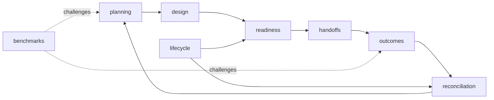

# Module Map

`bijux-proteomics-lab` converts evidence needs into governed experimental work and returns observations to the evidence system. It distinguishes scientific advice, operational readiness, execution handoff, observed outcome, and evidence promotion so that none of those states is mistaken for another.

## Owner families

| Family | Responsibility |
| --- | --- |
| `planning` | Advisory and executable assay plans, priorities, dependencies, batches, queues, capacity, materials, and schedules |
| `design` | Experiment and protocol contracts |
| `readiness` | Operational gates across capacity, instruments, materials, staffing, budget, controls, provenance, evidence, and backlog |
| `handoffs` | Serialized artifacts, explanations, PTM context, QC feedback, risks, exports, and explicit transitions |
| `outcomes` | Observations, acceptance rules, normalized outcome states, failure classes, rerun policy, and feedback records |
| `lifecycle` | Review-queue transitions, assay progression, promotion state, and transition-history audits |
| `reconciliation` | Follow-up selection and the connection between observed outcomes and open evidence needs |
| `benchmarks` | Claims, rehearsals, follow-up, outcome dossiers, and learning-oriented challenge cases |

The root API exposes `build_advisory_assay_plan`, `build_executable_assay_plan`, and `plan_experiment_batches`. That narrow surface makes the critical distinction visible at import time: advice can guide planning, while executable work requires additional operational evidence.

## Scope boundary

Lab models laboratory intent and state; it does not drive instruments or operate job infrastructure. A plan marked ready is a reviewed contract for execution, not proof that work ran. An outcome records what was observed, not automatic permission to promote a claim into durable knowledge.
