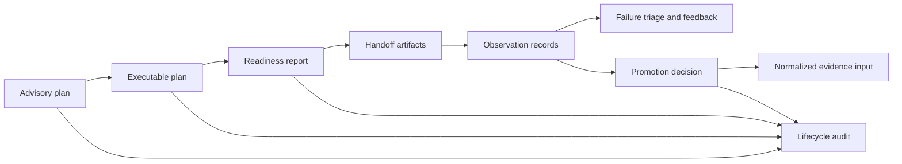

# State and Persistence

Lab state records the changing contract between scientific intent and physical work. Plans, readiness, handoffs, observations, reviews, and promotion decisions remain distinct durable records linked by stable identifiers.

## Durable lab state

- plan identity, kind, evidence gaps, assay intent, dependencies, batches, priority, samples, gates, and preflight checks;
- readiness inputs and findings for capacity, instruments, materials, staffing, budget, controls, provenance, evidence, and queue pressure;
- handoff artifacts, compatibility reports, contract issues, explanations, risks, exports, and approved transition lists;
- observations with metric, unit, replicate values, dispersion, normalization, QC, detection limits, censoring, batch concerns, and interpretation confidence;
- outcomes with result state, failure class, uncertainty, acceptance rule, and rerun policy;
- review-queue, assay-lifecycle, and promotion transitions with actor, reason, time, and audit issues;
- feedback, reconciliation, anomaly, latency, lineage-coverage, and outcome-dossier reports.

## Ownership and immutability

Runtime may persist and transport these documents, but lab owns their operational meaning. Knowledge owns the normalized evidence after successful promotion. A later plan, rerun, or interpretation supersedes earlier state through linked records; it does not overwrite the approved handoff or original observation.

This separation allows a reviewer to reconstruct what was proposed, what was authorized, what was performed, what was observed, and what was finally accepted as evidence.
