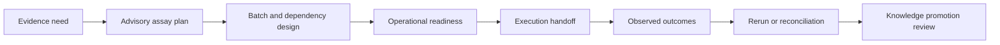

# Capability Map

`bijux-proteomics-lab` governs the conversion of an evidence need into responsible experimental work and the return of observations into evidence memory. It represents planning and review; physical instrument control remains outside the package.

## Operational capabilities

| Capability | Governed content |
| --- | --- |
| Advisory planning | evidence gaps, assay recommendations, scientific rationale, blocking status, and wet-lab actions |
| Executable planning | instruction identity, assay and batch identity, sample kind, objective, dependencies, and preflight checks |
| Batch design | ordering, priority, sample requirements, prerequisite assays, review gates, and scheduling |
| Resource review | instruments, capacity, materials, staffing, cost, lead time, and backlog pressure |
| Scientific readiness | required controls, provenance completeness, evidence strength, assay feasibility, and risk |
| Handoff | stable artifacts, explanations, exports, PTM context, QC feedback, risks, and transition dispositions |
| Outcome interpretation | observations, units, replicates, dispersion, QC, censoring, acceptance rules, and uncertainty |
| Failure and rerun | technical, biological, material, interpretation, reproducibility, and inconclusive outcomes |
| Lifecycle | review queues, assay progression, promotion decisions, audited transitions, and supersession |
| Reconciliation | follow-up actions and feedback from observed outcomes to open evidence needs |

The root API exposes advisory plan construction, executable plan construction, and batch planning. A plan can be scientifically useful yet operationally blocked; a completed assay can be technically valid yet biologically negative; a valid outcome can still require review before knowledge promotion.
