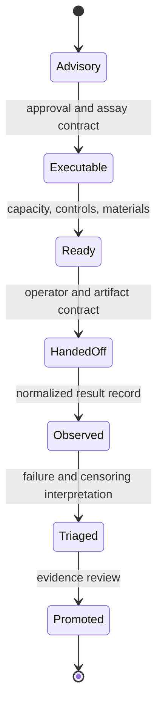

# Change Principles

A Lab change is safe only when it preserves the distinction between advice,
approved intent, operational readiness, execution handoff, observation,
interpretation, and evidence promotion. These states may be related, but none
proves the next.

## Classify The Change

| Changed surface | Questions that must be answered | Required evidence |
| --- | --- | --- |
| assay or protocol design | Did controls, replicates, acceptance, or sample meaning change? | design fixtures and scientific review |
| advisory-to-executable transition | What new approval makes work actionable? | transition tests and refusal cases |
| readiness | Are capacity, inventory, staffing, dependencies, and controls current? | dated readiness snapshot |
| queue or schedule | Did burden, priority, fairness, or prerequisite ordering change? | deterministic queue examples and rationale |
| handoff | Can an operator reconstruct intent, inputs, protocol, owner, and expected outputs? | serialization and round-trip evidence |
| observation | Are units, detection limits, censoring, failure class, and provenance preserved? | normalized outcome fixtures |
| promotion | Why may an observation become Knowledge evidence? | separate promotion decision and lineage |
| learning feedback | Which observed outcome may influence a later policy or plan? | eligibility, provenance, and adaptation audit |

## Invariants

- Advisory records remain non-executable until an explicit transition succeeds.
- Readiness expires when its operational snapshot is no longer current.
- Missing prerequisites and controls block affected work.
- Technical failure, biological failure, and censored measurement remain
  distinguishable.
- Promotion is a separate review; successful execution is insufficient.
- Every transition retains the actor, prior state, rationale, and source
  artifacts required to reconstruct it.
- Storage or serialization changes do not silently alter lifecycle meaning.

## Cross-Package Changes

Change Foundation when shared identifiers or provenance primitives move; Core
when scientific result meaning moves; Knowledge when evidence custody moves;
and Intelligence when recommendation policy moves. Lab owns the downstream
feasibility, handoff, observation, and outcome consequence—not those upstream
authorities.

A change spanning several lifecycle states should be split by semantic owner
unless atomicity is required to preserve one public transition contract.
