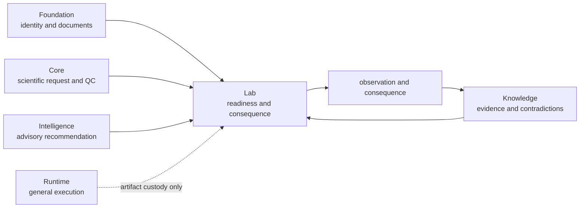

# Dependencies and adjacencies

Lab sits at the operational end of the evidence chain. Published metadata
declares Foundation, Core, and Knowledge as product prerequisites. Its source
uses Foundation records throughout, consumes Knowledge evidence for planning
and outcome ingestion, and uses Intelligence records in bounded follow-up and
review paths. It does not depend on Runtime to define laboratory authority.

The diagram shows record flow and authority. It is not permission for Lab to
rewrite scientific results, evidence bundles, or recommendations as they cross
the boundary.

## Dependency contract

| Dependency | Lab consumes | Ownership that remains upstream |
| --- | --- | --- |
| Foundation | assay, batch, program, gate, claim, and document identities; typed outcomes | canonical representation and compatibility |
| Core | scientific question, measurement requirements, analytical QC, and validation context | calculation, scientific result, and family acceptance |
| Knowledge | versioned evidence, contradictions, gaps, and observed-evidence ingestion | source custody, relationship, and sufficiency |
| Intelligence | advisory candidate and follow-up records in bounded review paths | ranking, sensitivity, confidence, and recommendation posture |
| Pydantic | strict plans, handoffs, observations, and consequence records | readiness policy and human authorization remain explicit Lab contracts |

## Runtime adjacency

Runtime may execute software that produces an input artifact or transports a
lab handoff, but it does not make an assay operationally ready. Lab owns the
material, control, protocol, capacity, custody, and answerability checks that
separate an advisory plan from an executable handoff.

| Runtime fact | Lab decision that still must occur |
| --- | --- |
| workflow completed | are the scientific inputs sufficient for assay design? |
| artifact hash matches | does the handoff contain the required controls, materials, and acceptance criteria? |
| provider succeeded | is the requested measurement feasible and safe under current capacity? |
| archive was delivered | did an accountable operator accept custody of exact instructions? |

## Dependency placement rules

| Proposed behavior | Correct owner |
| --- | --- |
| proteomics calculation or analytical threshold | Core |
| source relationship or contradiction resolution | Knowledge |
| ranking or recommendation policy | Intelligence |
| generic provider, retry, checkpoint, or run transport | Runtime |
| assay readiness, scheduling, custody, observation, or requested-versus-observed reconciliation | Lab |

## Review the edge

Before adding or widening a dependency, verify that:

1. every upstream record retains its owner and immutable identity;
2. advisory and executable plans remain distinct types and states;
3. missing controls, materials, capacity, or authority can produce refusal;
4. observations preserve QC, deviations, failures, and inconclusive outcomes;
5. evidence feedback creates a new Knowledge record rather than rewriting the
   plan or recommendation.

Continue with [lab consequence](lab-consequence.md),
[outcome learning loops](outcome-learning-loops.md), and
[dependency governance](../quality/dependency-governance.md).
