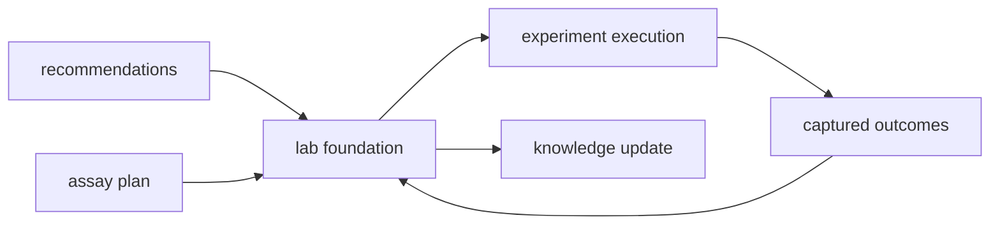

# Foundation

The lab foundation section exists to answer one downstream question honestly:
what assay consequence is justified, what burden and controls does that impose,
and what observed outcomes should feed back into later review. If a page here
describes generic orchestration without naming assay burden or outcome learning,
it is not yet using the right owner language.

That honesty matters more now because upstream workflow, grounding, and
recommendation surfaces are stronger than before. Better signal creates sharper
assay consequence decisions, more explicit control demands, and more queue or
material burden that has to be named before the repository can claim the next
step is practical.

## Why This Section Is More Important Now

- it is where stronger upstream science gets translated into actual assay
  burden rather than optimistic follow-up prose
- it names the practical limits that keep recommendation surfaces honest when
  controls, staffing, material, or instrument time become the real bottleneck
- it makes observed outcomes part of the scientific story instead of letting
  them disappear after execution

## What This Section Protects

- assay-readiness and control demands that stay explicit before spend is
  committed
- burden-aware handoff honesty instead of optimistic downstream wording
- observed-outcome learning that stays tied to real requested follow-up

## What This Section Now Carries

- assay consequence framing that distinguishes compelling follow-up from costly
  but weak curiosity
- queue or material burden that must stay visible before downstream spend is
  normalized
- observed outcomes that feed back into later evidence and recommendation
  review

## Start With

- Open [Package Overview](https://bijux.io/bijux-proteomics/07-bijux-proteomics-lab/foundation/package-overview/) for the shortest statement of
  the package role.
- Open [Ownership Boundary](https://bijux.io/bijux-proteomics/07-bijux-proteomics-lab/foundation/ownership-boundary/) when the question is
  whether a change belongs here or in a neighbor.
- Open [This Package Does Not Own](https://bijux.io/bijux-proteomics/07-bijux-proteomics-lab/this-package-does-not-own/)
  when the question is whether a proposal is trying to smuggle recommendation,
  scientific law, or runtime control into lab consequence.
- Open [Scope and Non-Goals](https://bijux.io/bijux-proteomics/07-bijux-proteomics-lab/foundation/scope-and-non-goals/) when a proposed change
  risks broadening the package.
- Open [Capability Map](https://bijux.io/bijux-proteomics/07-bijux-proteomics-lab/foundation/capability-map/) when you need the concrete work
  the package is allowed to do.

## Section Pages

- [Package Overview](https://bijux.io/bijux-proteomics/07-bijux-proteomics-lab/foundation/package-overview/)
- [Scope and Non-Goals](https://bijux.io/bijux-proteomics/07-bijux-proteomics-lab/foundation/scope-and-non-goals/)
- [Ownership Boundary](https://bijux.io/bijux-proteomics/07-bijux-proteomics-lab/foundation/ownership-boundary/)
- [This Package Does Not Own](https://bijux.io/bijux-proteomics/07-bijux-proteomics-lab/this-package-does-not-own/)
- [Capability Map](https://bijux.io/bijux-proteomics/07-bijux-proteomics-lab/foundation/capability-map/)
- [Dependencies and Adjacencies](https://bijux.io/bijux-proteomics/07-bijux-proteomics-lab/foundation/dependencies-and-adjacencies/)
- [Repository Fit](https://bijux.io/bijux-proteomics/07-bijux-proteomics-lab/foundation/repository-fit/)
- [Lifecycle Overview](https://bijux.io/bijux-proteomics/07-bijux-proteomics-lab/foundation/lifecycle-overview/)
- [Domain Language](https://bijux.io/bijux-proteomics/07-bijux-proteomics-lab/foundation/domain-language/)
- [Change Principles](https://bijux.io/bijux-proteomics/07-bijux-proteomics-lab/foundation/change-principles/)

## What This Section Settles

- when a change truly affects assay consequence instead of only upstream
  recommendation or runtime delivery
- which control demands, material limits, and burden signals must remain visible
- how observed outcomes should feed back into later evidence and recommendation
  review

## Reader Questions This Section Can Answer Well

- why a downstream step is still exploratory even when the recommendation page
  sounds strong
- which control demands or queue limits keep a family below operational
  confidence
- how a requested follow-up should be re-read once the observed assay outcome
  arrives

## Strongest Lab Proof

- start with
  [Package Overview](https://bijux.io/bijux-proteomics/07-bijux-proteomics-lab/foundation/package-overview/)
  when the question is whether a downstream step is truly lab-owned
- continue to
  [This Package Does Not Own](https://bijux.io/bijux-proteomics/07-bijux-proteomics-lab/this-package-does-not-own/)
  when someone is trying to hide recommendation posture or workflow law inside
  lab consequence language
- open refusal and outcome-learning pages once the real question becomes
  whether to spend, queue, narrow, rerun, or stop

## First Proof Check

- `packages/bijux-proteomics-lab/src/bijux_proteomics_lab`
- `packages/bijux-proteomics-lab/tests`
- neighboring handbooks once the change crosses the local boundary

## Neighbors

- Open [bijux-proteomics-intelligence](https://bijux.io/bijux-proteomics/05-bijux-proteomics-intelligence/)
  when the question leaves assay planning, outcome handling, and lab-facing loop control.
- Open [bijux-proteomics-runtime](https://bijux.io/bijux-proteomics/09-bijux-proteomics-runtime/)
  when the issue is clearly outside this package's local role.
