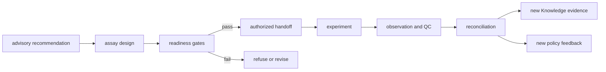
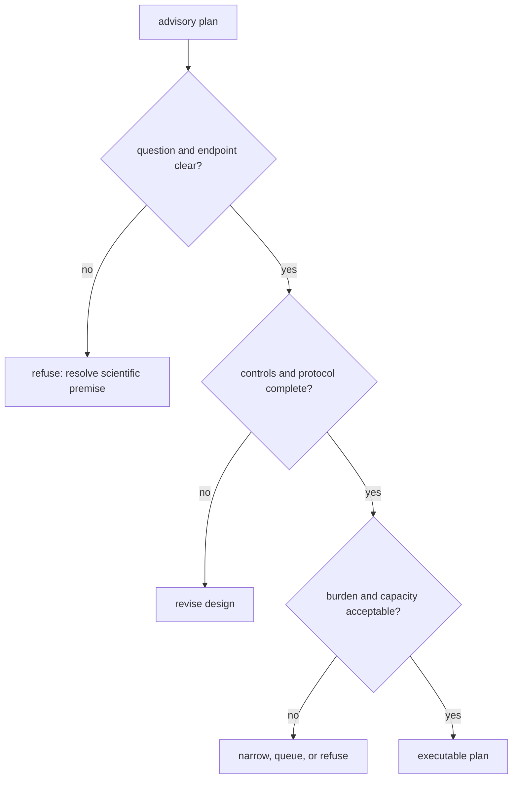

# Laboratory foundations

Lab owns the boundary where an advisory scientific action becomes an
operational assay, incurs material and opportunity cost, and produces an
observed consequence. It protects that boundary with readiness, controls,
explicit handoff, QC, reconciliation, and refusal.

An assay consequence is therefore more than a proposed experiment. It joins
control demands, queue or material burden, operator custody, acceptance rules,
and observed outcomes in one reviewable chain. If any link is missing, Lab must
retain the plan as advisory, narrow it, or refuse execution.

## Laboratory routes

| Question | Guide | Governing record |
| --- | --- | --- |
| What does Lab own? | [Package overview](package-overview.md) | design, readiness, handoff, observation, and reconciliation |
| Is a proposal a lab concern? | [Ownership boundary](ownership-boundary.md) | operational assay consequence rather than upstream policy |
| Which planning surfaces exist? | [Capability map](capability-map.md) | plans, queues, batches, schedules, handoffs, outcomes |
| What remains outside? | [Scope and non-goals](scope-and-non-goals.md) | scientific truth, recommendation ranking, and general runtime execution |
| What burden does follow-up impose? | [Lab consequence](lab-consequence.md) | controls, materials, capacity, risk, and opportunity cost |
| Why did a plan stop? | [Workflow refusal handbook](workflow-refusal-handbook.md) | reason code, blocking evidence, and safe next action |
| How do outcomes change future work? | [Outcome learning loops](outcome-learning-loops.md) | reconciliation and versioned feedback |

The [package boundary](../this-package-does-not-own.md) resolves cases
where recommendation policy or generic orchestration is being mislabeled as
laboratory ownership.

## Readiness protocol

An executable assay requires more than a plausible recommendation:

1. The biological question and measurable endpoint are explicit.
2. The upstream evidence and recommendation records resolve by identity and
   version.
3. Positive, negative, process, and interpretation controls are sufficient for
   the stated question.
4. Protocol, materials, samples, instrument requirements, acceptance criteria,
   and failure handling are complete.
5. Capacity, batching, scheduling, safety, and opportunity-cost constraints are
   acceptable.
6. Ownership and handoff custody are unambiguous.
7. The outcome can be reconciled back to the requested measurement.

An advisory plan may identify missing items. Only an executable plan has
cleared the stronger operational gate.

## Consequence, burden, and refusal

The [lab consequence](lab-consequence.md) route makes downstream cost visible
before work is normalized into a queue. Burden includes scarce sample,
reagents, instrument time, operator time, controls, competing assays, and the
risk of producing an uninterpretable result.

Refusal preserves the reason work is unsafe, wasteful, under-specified, or
unable to answer the question. It also identifies a valid next action. A lab
refusal is not an execution crash and does not invalidate the upstream result;
it bounds what may happen next.

## This Package Does Not Own

Lab does not establish scientific truth, maintain the evidence graph, rank
recommendations, or provide general-purpose execution infrastructure. It owns
the stronger operational question: whether a proposed assay can be authorized
under its control demands, queue or material burden, safety constraints, and
acceptance rules. Knowledge, Intelligence, and Runtime retain their respective
authorities throughout that handoff.

## Handoff and observation

An authorized handoff binds stable assay, batch, sample, material, protocol,
control, and acceptance identities to an operator and schedule. Deviations are
recorded rather than absorbed into narrative notes.

Observation records facts: measurements, QC, missingness, deviations, and
operational failures. Reconciliation compares those observations with the
requested endpoint and classifies the follow-up as supported, weakened,
rejected, inconclusive, or requiring another cycle. The
[outcome learning loop](outcome-learning-loops.md) then creates new Knowledge
evidence and, when appropriate, a new Intelligence calibration record.

## Evolution rules

The [domain language](domain-language.md) stabilizes advisory, executable,
readiness, handoff, observation, reconciliation, and consequence. The
[change principles](change-principles.md) protect append-only history and
authority boundaries when plans or policies evolve. [Dependencies and adjacencies](dependencies-and-adjacencies.md),
[repository fit](repository-fit.md), and [lifecycle overview](lifecycle-overview.md)
connect the lab loop to neighboring packages without granting Lab ownership of
their scientific, evidential, or execution state.
