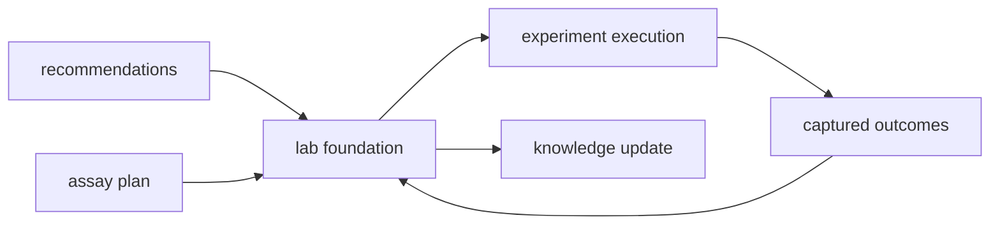

# Foundation

The foundation section explains the durable role of `bijux-proteomics-lab` before it
explains implementation detail. Use it to resolve why lab-facing decisions belong here instead of dissolving into ranking or runtime layers.

## What This Section Protects

- the experimental loop as something richer than task orchestration
- outcome handling that stays connected to real assay intent
- a boundary where lab judgment can stay distinct from scoring and runtime
  mechanics

## Start With

- Open [Package Overview](https://bijux.io/bijux-proteomics/07-bijux-proteomics-lab/foundation/package-overview/) for the shortest statement of
  the package role.
- Open [Ownership Boundary](https://bijux.io/bijux-proteomics/07-bijux-proteomics-lab/foundation/ownership-boundary/) when the question is
  whether a change belongs here or in a neighbor.
- Open [Scope and Non-Goals](https://bijux.io/bijux-proteomics/07-bijux-proteomics-lab/foundation/scope-and-non-goals/) when a proposed change
  risks broadening the package.
- Open [Capability Map](https://bijux.io/bijux-proteomics/07-bijux-proteomics-lab/foundation/capability-map/) when you need the concrete work
  the package is allowed to do.

## Section Pages

- [Package Overview](https://bijux.io/bijux-proteomics/07-bijux-proteomics-lab/foundation/package-overview/)
- [Scope and Non-Goals](https://bijux.io/bijux-proteomics/07-bijux-proteomics-lab/foundation/scope-and-non-goals/)
- [Ownership Boundary](https://bijux.io/bijux-proteomics/07-bijux-proteomics-lab/foundation/ownership-boundary/)
- [Capability Map](https://bijux.io/bijux-proteomics/07-bijux-proteomics-lab/foundation/capability-map/)
- [Dependencies and Adjacencies](https://bijux.io/bijux-proteomics/07-bijux-proteomics-lab/foundation/dependencies-and-adjacencies/)
- [Repository Fit](https://bijux.io/bijux-proteomics/07-bijux-proteomics-lab/foundation/repository-fit/)
- [Lifecycle Overview](https://bijux.io/bijux-proteomics/07-bijux-proteomics-lab/foundation/lifecycle-overview/)
- [Domain Language](https://bijux.io/bijux-proteomics/07-bijux-proteomics-lab/foundation/domain-language/)
- [Change Principles](https://bijux.io/bijux-proteomics/07-bijux-proteomics-lab/foundation/change-principles/)

## What This Section Settles

- when a behavior is truly lab-facing instead of merely operational
- how plans and outcomes should stay legible as one loop
- when a proposed change belongs back in intelligence or runtime instead of in
  this package

## First Proof Check

- `packages/bijux-proteomics-lab/src/bijux_proteomics_lab`
- `packages/bijux-proteomics-lab/tests`
- neighboring handbooks once the change crosses the local boundary

## Neighbors

- Open [bijux-proteomics-intelligence](https://bijux.io/bijux-proteomics/05-bijux-proteomics-intelligence/)
  when the question leaves assay planning, outcome handling, and lab-facing loop control.
- Open [bijux-proteomics-runtime](https://bijux.io/bijux-proteomics/09-bijux-proteomics-runtime/)
  when the issue is clearly outside this package's local role.
